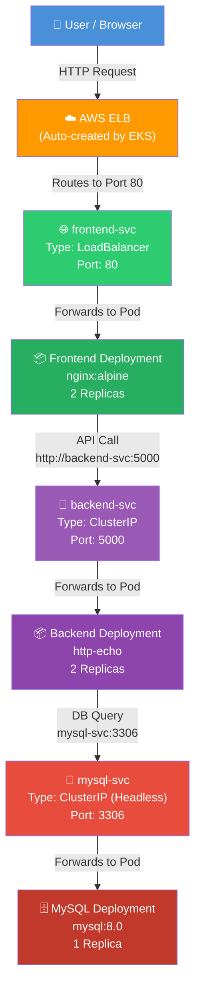
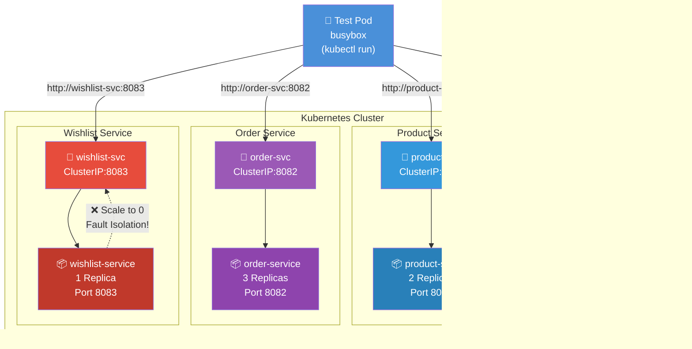
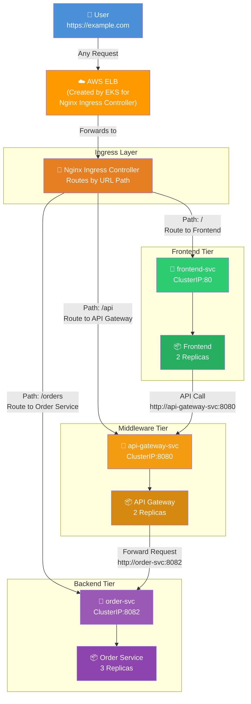
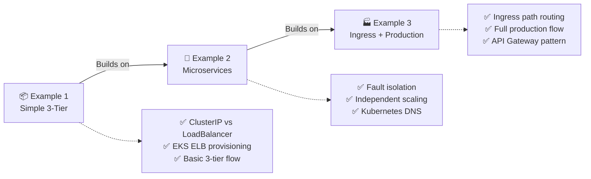

# 🚀 EKS Hands-On Practice: 3-Tier & Microservices Architecture
> Based on **Day 11: Microservices & 3-Tier Architecture | CKA Course 2025**

---

## 📋 Table of Contents
- [Example 1 – Simple 3-Tier App](#example-1--simple-3-tier-app-frontend--backend--database)
- [Example 2 – E-Commerce Microservices](#example-2--e-commerce-microservices-4-independent-services)
- [Example 3 – Full 3-Tier with Ingress](#example-3--full-3-tier-with-ingress-production-like)

---

## Example 1 – Simple 3-Tier App (Frontend → Backend → Database)

### 🗺️ Communication Diagram



### 📌 Key Concepts in This Example
| Component | Type | Why |
|---|---|---|
| `frontend-svc` | **LoadBalancer** | Needs external access → EKS creates AWS ELB |
| `backend-svc` | **ClusterIP** | Internal only, frontend talks to it via DNS |
| `mysql-svc` | **Headless ClusterIP** | Stable DNS for stateful DB pod |

### 📄 YAML Files

#### `1-database.yaml`
```yaml
apiVersion: apps/v1
kind: Deployment
metadata:
  name: mysql
spec:
  replicas: 1
  selector:
    matchLabels:
      app: mysql
  template:
    metadata:
      labels:
        app: mysql
    spec:
      containers:
      - name: mysql
        image: mysql:8.0
        env:
        - name: MYSQL_ROOT_PASSWORD
          value: "rootpass"
        - name: MYSQL_DATABASE
          value: "shopdb"
        ports:
        - containerPort: 3306
---
apiVersion: v1
kind: Service
metadata:
  name: mysql-svc
spec:
  selector:
    app: mysql
  ports:
  - port: 3306
    targetPort: 3306
  clusterIP: None   # Headless - stable DNS for StatefulSet pattern
```

#### `2-backend.yaml`
```yaml
apiVersion: apps/v1
kind: Deployment
metadata:
  name: backend
spec:
  replicas: 2
  selector:
    matchLabels:
      app: backend
  template:
    metadata:
      labels:
        app: backend
    spec:
      containers:
      - name: backend
        image: hashicorp/http-echo
        args:
        - "-text=Hello from Backend - Order Service"
        - "-listen=:5000"
        ports:
        - containerPort: 5000
---
apiVersion: v1
kind: Service
metadata:
  name: backend-svc
spec:
  selector:
    app: backend
  ports:
  - port: 5000
    targetPort: 5000
```

#### `3-frontend.yaml`
```yaml
apiVersion: apps/v1
kind: Deployment
metadata:
  name: frontend
spec:
  replicas: 2
  selector:
    matchLabels:
      app: frontend
  template:
    metadata:
      labels:
        app: frontend
    spec:
      containers:
      - name: frontend
        image: nginx:alpine
        ports:
        - containerPort: 80
---
apiVersion: v1
kind: Service
metadata:
  name: frontend-svc
spec:
  selector:
    app: frontend
  type: LoadBalancer    # EKS will provision an AWS ELB
  ports:
  - port: 80
    targetPort: 80
```

### ▶️ Apply & Test Commands
```bash
kubectl apply -f 1-database.yaml
kubectl apply -f 2-backend.yaml
kubectl apply -f 3-frontend.yaml

# Watch all pods come up
kubectl get pods -w

# Get ELB DNS (takes ~2 min on EKS)
kubectl get svc frontend-svc

# Test
curl http://<ELB-DNS>
```

### ✅ What You Learn
- How **ClusterIP** enables internal pod-to-pod DNS communication
- How **LoadBalancer** service type triggers AWS ELB provisioning on EKS
- How **Headless service** provides stable DNS for databases
- 3-tier request flow: User → ELB → Frontend → Backend → DB

---

## Example 2 – E-Commerce Microservices (4 Independent Services)

### 🗺️ Communication Diagram



### 📌 Key Concepts in This Example
| Service | Replicas | Reason |
|---|---|---|
| `user-service` | 1 | Low traffic – auth only |
| `product-service` | 2 | Medium – browse requests |
| `order-service` | **3** | High – payment processing needs more pods |
| `wishlist-service` | 1 | Low priority – can go down independently |

> 💡 **Fault Isolation in Action:** Scale `wishlist-service` to 0 replicas → Order and Product services keep running. This is the core microservices benefit from Day 11!

### 📄 YAML File

#### `ecommerce-microservices.yaml`
```yaml
---
# USER SERVICE
apiVersion: apps/v1
kind: Deployment
metadata:
  name: user-service
spec:
  replicas: 1
  selector:
    matchLabels:
      app: user-service
  template:
    metadata:
      labels:
        app: user-service
    spec:
      containers:
      - name: user-service
        image: hashicorp/http-echo
        args: ["-text=USER SERVICE: Auth OK - user@example.com", "-listen=:8080"]
        ports:
        - containerPort: 8080
---
apiVersion: v1
kind: Service
metadata:
  name: user-svc
spec:
  selector:
    app: user-service
  ports:
  - port: 8080
---
# PRODUCT SERVICE
apiVersion: apps/v1
kind: Deployment
metadata:
  name: product-service
spec:
  replicas: 2
  selector:
    matchLabels:
      app: product-service
  template:
    metadata:
      labels:
        app: product-service
    spec:
      containers:
      - name: product-service
        image: hashicorp/http-echo
        args: ["-text=PRODUCT SERVICE: iPhone 15 - $999", "-listen=:8081"]
        ports:
        - containerPort: 8081
---
apiVersion: v1
kind: Service
metadata:
  name: product-svc
spec:
  selector:
    app: product-service
  ports:
  - port: 8081
---
# ORDER SERVICE
apiVersion: apps/v1
kind: Deployment
metadata:
  name: order-service
spec:
  replicas: 3
  selector:
    matchLabels:
      app: order-service
  template:
    metadata:
      labels:
        app: order-service
    spec:
      containers:
      - name: order-service
        image: hashicorp/http-echo
        args: ["-text=ORDER SERVICE: Order #1042 confirmed!", "-listen=:8082"]
        ports:
        - containerPort: 8082
---
apiVersion: v1
kind: Service
metadata:
  name: order-svc
spec:
  selector:
    app: order-service
  ports:
  - port: 8082
---
# WISHLIST SERVICE
apiVersion: apps/v1
kind: Deployment
metadata:
  name: wishlist-service
spec:
  replicas: 1
  selector:
    matchLabels:
      app: wishlist-service
  template:
    metadata:
      labels:
        app: wishlist-service
    spec:
      containers:
      - name: wishlist-service
        image: hashicorp/http-echo
        args: ["-text=WISHLIST SERVICE: 3 saved items", "-listen=:8083"]
        ports:
        - containerPort: 8083
---
apiVersion: v1
kind: Service
metadata:
  name: wishlist-svc
spec:
  selector:
    app: wishlist-service
  ports:
  - port: 8083
```

### ▶️ Apply & Test Commands
```bash
kubectl apply -f ecommerce-microservices.yaml

# Verify all 4 services running
kubectl get deployments
kubectl get svc

# Test inter-service communication from inside cluster
kubectl run test-pod --image=busybox --rm -it --restart=Never -- sh

# Inside the pod - call each service by DNS name
wget -qO- http://user-svc:8080
wget -qO- http://product-svc:8081
wget -qO- http://order-svc:8082
wget -qO- http://wishlist-svc:8083

# ---- Simulate Wishlist crash (Day 11: fault isolation) ----
kubectl scale deployment wishlist-service --replicas=0

# Order and Product still work!
wget -qO- http://order-svc:8082      # ✅ Still works
wget -qO- http://wishlist-svc:8083   # ❌ Fails - only wishlist down

# Bring it back
kubectl scale deployment wishlist-service --replicas=1
```

### ✅ What You Learn
- **Independent scaling** — each service has different replica counts based on load
- **Kubernetes DNS** — services talk via `<service-name>:<port>` without IP addresses
- **Fault isolation** — killing one service doesn't affect others
- **Microservices naming** — why it's "Wishlist Service" not "Wishlist Microservice"

---

## Example 3 – Full 3-Tier with Ingress (Production-Like)

### 🗺️ Communication Diagram



### 📌 Path-Based Routing Table
| URL Path | Routes To | Service Port |
|---|---|---|
| `/` | `frontend-svc` | 80 |
| `/api` | `api-gateway-svc` | 8080 |
| `/orders` | `order-svc` | 8082 |

> 💡 This mirrors the **exact Day 11 request flow**: User → Ingress → Frontend → API Gateway (Middleware) → Backend Service

### 📄 YAML Files

#### Install Nginx Ingress Controller
```bash
kubectl apply -f https://raw.githubusercontent.com/kubernetes/ingress-nginx/controller-v1.10.0/deploy/static/provider/aws/deploy.yaml

# Wait for controller to be ready
kubectl wait --namespace ingress-nginx \
  --for=condition=ready pod \
  --selector=app.kubernetes.io/component=controller \
  --timeout=120s
```

#### `full-3tier-ingress.yaml`
```yaml
---
# FRONTEND
apiVersion: apps/v1
kind: Deployment
metadata:
  name: frontend
spec:
  replicas: 2
  selector:
    matchLabels:
      app: frontend
  template:
    metadata:
      labels:
        app: frontend
    spec:
      containers:
      - name: frontend
        image: hashicorp/http-echo
        args: ["-text=FRONTEND: React App Loaded", "-listen=:80"]
        ports:
        - containerPort: 80
---
apiVersion: v1
kind: Service
metadata:
  name: frontend-svc
spec:
  selector:
    app: frontend
  ports:
  - port: 80
---
# API GATEWAY (Middleware)
apiVersion: apps/v1
kind: Deployment
metadata:
  name: api-gateway
spec:
  replicas: 2
  selector:
    matchLabels:
      app: api-gateway
  template:
    metadata:
      labels:
        app: api-gateway
    spec:
      containers:
      - name: api-gateway
        image: hashicorp/http-echo
        args: ["-text=API GATEWAY: Routing to backend services...", "-listen=:8080"]
        ports:
        - containerPort: 8080
---
apiVersion: v1
kind: Service
metadata:
  name: api-gateway-svc
spec:
  selector:
    app: api-gateway
  ports:
  - port: 8080
---
# BACKEND - ORDER SERVICE
apiVersion: apps/v1
kind: Deployment
metadata:
  name: order-service
spec:
  replicas: 3
  selector:
    matchLabels:
      app: order-service
  template:
    metadata:
      labels:
        app: order-service
    spec:
      containers:
      - name: order-service
        image: hashicorp/http-echo
        args: ["-text=ORDER SERVICE: Processing order #5001", "-listen=:8082"]
        ports:
        - containerPort: 8082
---
apiVersion: v1
kind: Service
metadata:
  name: order-svc
spec:
  selector:
    app: order-service
  ports:
  - port: 8082
---
# INGRESS - Routes traffic based on URL path
apiVersion: networking.k8s.io/v1
kind: Ingress
metadata:
  name: app-ingress
  annotations:
    nginx.ingress.kubernetes.io/rewrite-target: /
spec:
  ingressClassName: nginx
  rules:
  - http:
      paths:
      - path: /
        pathType: Prefix
        backend:
          service:
            name: frontend-svc
            port:
              number: 80
      - path: /api
        pathType: Prefix
        backend:
          service:
            name: api-gateway-svc
            port:
              number: 8080
      - path: /orders
        pathType: Prefix
        backend:
          service:
            name: order-svc
            port:
              number: 8082
```

### ▶️ Apply & Test Commands
```bash
kubectl apply -f full-3tier-ingress.yaml

# Get the Ingress ELB address (takes ~2 min)
kubectl get ingress app-ingress

# Test each path - mirrors Day 11 request flow
curl http://<INGRESS-ELB>/           # ✅ Hits Frontend
curl http://<INGRESS-ELB>/api        # ✅ Hits API Gateway (Middleware)
curl http://<INGRESS-ELB>/orders     # ✅ Hits Order Service (Backend)
```

### ✅ What You Learn
- **Ingress** acts as a smart reverse proxy — one ELB, multiple services
- **Path-based routing** — `/`, `/api`, `/orders` go to different pods
- How **Nginx Ingress Controller** maps to AWS ELB on EKS
- The complete Day 11 request flow working in a real cluster

---

## 📊 Summary — What Each Example Teaches



| # | Example | Core Focus | Service Types Used |
|---|---|---|---|
| 1 | Simple 3-Tier | ClusterIP, LoadBalancer, EKS ELB | LoadBalancer, ClusterIP, Headless |
| 2 | E-Commerce Microservices | Fault isolation, independent scaling | ClusterIP only |
| 3 | Full 3-Tier + Ingress | Path routing, production-like flow | ClusterIP + Ingress |

> 🎯 **Recommended Order:** Do Example 1 → 2 → 3 in sequence. After Example 3, you'll have practiced every architecture concept from Day 11 on a real EKS cluster.

---

## 🔗 Reference Links
- [Microservices Explained – AWS](https://aws.amazon.com/microservices/)
- [Kubernetes Operators](https://kubernetes.io/docs/concepts/extend-kubernetes/operator/)
- [What is an API Gateway – Nginx](https://www.nginx.com/resources/glossary/api-gateway/)
- [API Gateway in Microservices](https://microservices.io/patterns/apigateway.html)
