# Day 12: Kubernetes Services In-Depth
## ClusterIP · NodePort · LoadBalancer · ExternalName | CKA Course 2025

> 📺 [Watch the video](https://www.youtube.com/watch?v=92NB8oQBtnc&ab_channel=CloudWithVarJosh)

---

## Table of Contents

1. [Why Do We Need Services?](#1-why-do-we-need-services)
2. [ClusterIP Service](#2-clusterip-service)
3. [NodePort Service](#3-nodeport-service)
4. [LoadBalancer Service](#4-loadbalancer-service)
5. [ExternalName Service](#5-externalname-service)
6. [Service Comparison Summary](#6-service-comparison-summary)

---

## 1. Why Do We Need Services?

Pods are **ephemeral** — they get new IP addresses every time they restart. Services solve two problems:

- Provide a **stable IP and DNS name** so pods can always be found
- Enable **load balancing** across multiple pod replicas

### Without Services vs With Services

```
❌ Without Services:
User ──► Frontend Pod (IP changes) ──► Backend Pod (IP changes)
         Problem: IPs are dynamic, hardcoding breaks

✅ With Services:
User ──► frontend-svc ──► Frontend Pod ──► backend-svc ──► Backend Pod
         Stable DNS name                   Stable DNS name
```

---

## 2. ClusterIP Service

### What is it?
The **default** service type. Exposes pods **internally within the cluster only**. Pods outside cannot reach it. Perfect for service-to-service communication.

### Office Analogy
> Internal phone extensions inside a building complex — HR dials extension 11 to reach Finance. No outside calls allowed.

### Communication Diagram

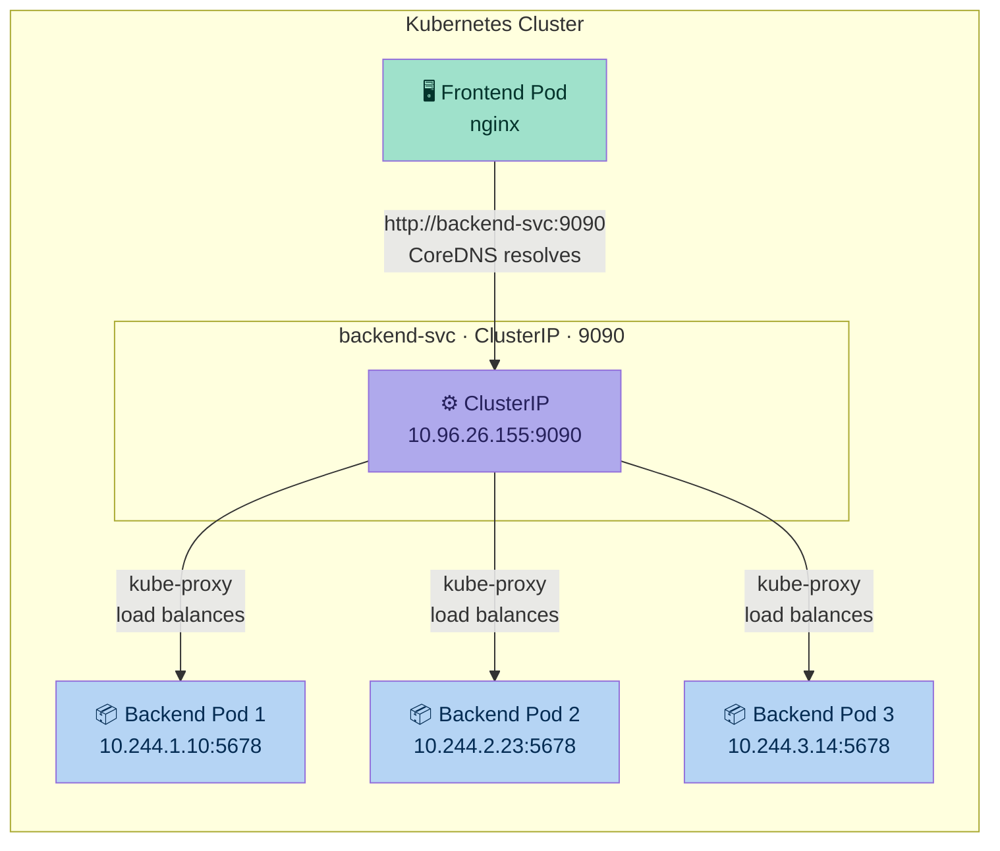

### Step-by-Step Request Flow

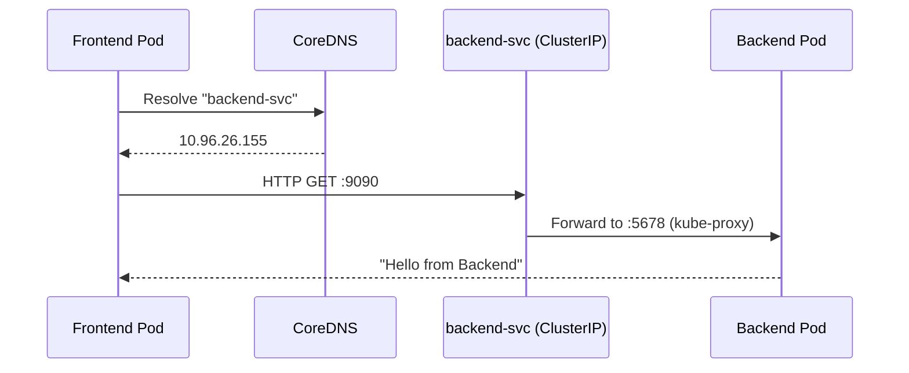

### Key Characteristics

| Property | Value |
|---|---|
| Access scope | Internal cluster only |
| DNS name | `backend-svc` |
| Stable IP | Yes (ClusterIP) |
| Load balancing | Yes (kube-proxy) |
| External access | ❌ No |

### YAML Manifests

#### Frontend Deployment
```yaml
# frontend-deploy.yaml
apiVersion: apps/v1
kind: Deployment
metadata:
  name: frontend-deploy
spec:
  replicas: 3
  selector:
    matchLabels:
      app: frontend
  template:
    metadata:
      labels:
        app: frontend
    spec:
      containers:
        - name: frontend-container
          image: nginx
```

#### Backend Deployment
```yaml
# backend-deploy.yaml
apiVersion: apps/v1
kind: Deployment
metadata:
  name: backend-deploy
spec:
  replicas: 3
  selector:
    matchLabels:
      app: backend
  template:
    metadata:
      labels:
        app: backend
    spec:
      containers:
      - name: backend-container
        image: hashicorp/http-echo
        args:
          - "-text=Hello from Backend"
```

#### Backend ClusterIP Service
```yaml
# backend-svc.yaml
apiVersion: v1
kind: Service
metadata:
  name: backend-svc
spec:
  type: ClusterIP          # Default — can omit this line
  ports:
    - protocol: TCP
      port: 9090           # Service port (what callers use)
      targetPort: 5678     # Container port (what pod listens on)
  selector:
    app: backend
```

### Deploy & Test
```bash
kubectl apply -f frontend-deploy.yaml
kubectl apply -f backend-deploy.yaml
kubectl apply -f backend-svc.yaml

# Verify
kubectl get svc backend-svc
# NAME          TYPE        CLUSTER-IP      PORT(S)    AGE
# backend-svc   ClusterIP   10.96.26.155    9090/TCP   10s

# Test from inside a pod
kubectl exec -it <frontend-pod-name> -- curl http://backend-svc:9090
# Response: Hello from Backend

# Check CoreDNS resolution
kubectl exec -it <frontend-pod-name> -- nslookup backend-svc
```

---

## 3. NodePort Service

### What is it?
Exposes pods **externally** using a **fixed port on every worker node's IP**. Access via `NodeIP:NodePort`. Built on top of ClusterIP.

### Office Analogy
> Each building has a front-desk number. External callers dial the front desk, who connects to the right department extension. If one building is down, caller must manually dial the other building's front desk.

### Communication Diagram

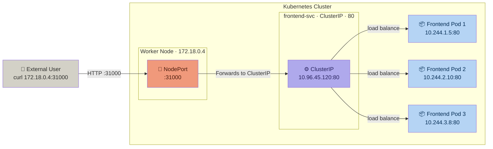

### Step-by-Step Request Flow

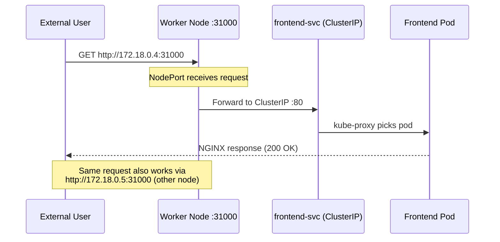

### KIND Cluster Setup for NodePort

```yaml
# kind-cluster.yaml
kind: Cluster
apiVersion: kind.x-k8s.io/v1alpha4
nodes:
  - role: control-plane
    image: kindest/node:v1.31.4@sha256:2cb39f7295fe7eafee0842b1052a599a4fb0f8bcf3f83d96c7f4864c357c6c30
    extraPortMappings:
      - containerPort: 31000   # Port inside KIND container
        hostPort: 31000        # Port on your local machine
  - role: worker
    image: kindest/node:v1.31.4@sha256:2cb39f7295fe7eafee0842b1052a599a4fb0f8bcf3f83d96c7f4864c357c6c30
  - role: worker
    image: kindest/node:v1.31.4@sha256:2cb39f7295fe7eafee0842b1052a599a4fb0f8bcf3f83d96c7f4864c357c6c30
```

### Key Characteristics

| Property | Value |
|---|---|
| Access scope | External (any node IP) |
| Port range | 30000–32767 |
| URL format | `http://<NodeIP>:<NodePort>` |
| Built on | ClusterIP |
| Fault tolerance | Manual — if node is down, switch IP |
| External access | ✅ Yes |

### YAML Manifests

#### Frontend Deployment
```yaml
# frontend-deploy.yaml
apiVersion: apps/v1
kind: Deployment
metadata:
  name: frontend-deploy
spec:
  replicas: 3
  selector:
    matchLabels:
      app: frontend
  template:
    metadata:
      labels:
        app: frontend
    spec:
      containers:
      - name: frontend-container
        image: nginx:latest
        ports:
        - containerPort: 80
```

#### Frontend NodePort Service
```yaml
# frontend-svc-nodeport.yaml
apiVersion: v1
kind: Service
metadata:
  name: frontend-svc
spec:
  type: NodePort
  selector:
    app: frontend
  ports:
    - protocol: TCP
      port: 80         # ClusterIP service port
      targetPort: 80   # Container port inside the pod
      nodePort: 31000  # External port (30000-32767)
                       # Omit this to let Kubernetes auto-assign
```

### Deploy & Test
```bash
# Create KIND cluster with port mapping first
kind delete cluster --name my-first-cluster
kind create cluster --name my-second-cluster --config kind-cluster.yaml

kubectl apply -f frontend-deploy.yaml
kubectl apply -f frontend-svc-nodeport.yaml

# Verify
kubectl get svc frontend-svc
# NAME           TYPE       CLUSTER-IP      EXTERNAL-IP   PORT(S)        AGE
# frontend-svc   NodePort   10.96.45.120    <none>        80:31000/TCP   5s

# Test from your local machine
curl http://localhost:31000
# Or using node IP
kubectl get nodes -o wide
curl http://172.18.0.4:31000
```

---

## 4. LoadBalancer Service

### What is it?
Provides a **single public IP** from the cloud provider (AWS ELB, GCP LB, Azure LB). Automatically routes to any healthy node. Built on top of NodePort + ClusterIP.

### Office Analogy
> A call center with a single easy-to-remember number. Caller dials the call center, which automatically routes to any healthy building's front desk, which connects to the right department.

### Communication Diagram

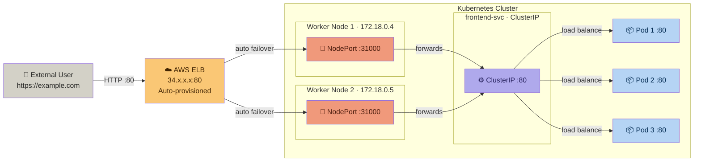

### Step-by-Step Request Flow

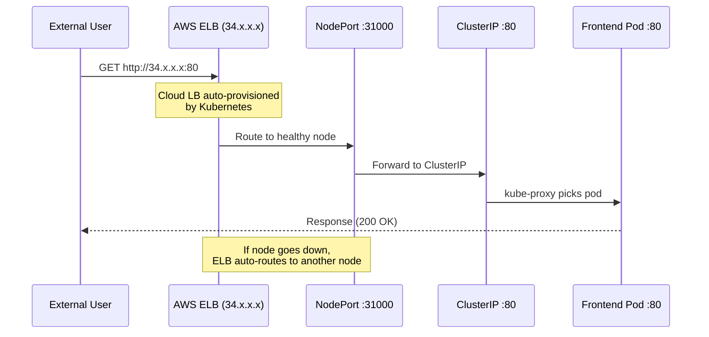

### How the Layers Stack

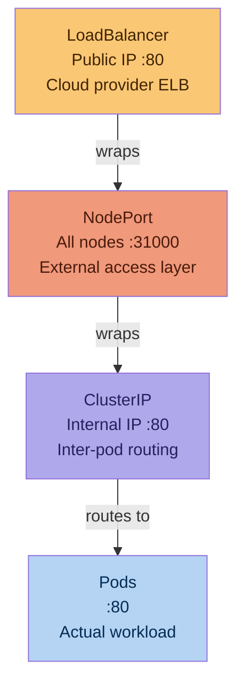

### Key Characteristics

| Property | Value |
|---|---|
| Access scope | External (public internet) |
| Public IP | Auto-assigned by cloud provider |
| Fault tolerance | Automatic (ELB handles failover) |
| Built on | NodePort + ClusterIP |
| Cost | Cloud LB charges apply |
| Production use | Common — but Ingress preferred for HTTP |

### YAML Manifest

```yaml
# frontend-svc-loadbalancer.yaml
apiVersion: v1
kind: Service
metadata:
  name: frontend-svc
spec:
  type: LoadBalancer
  selector:
    app: my-app
  ports:
    - protocol: TCP
      port: 80           # External port (what users hit)
      targetPort: 80     # Container port inside pod
      nodePort: 31000    # NodePort used internally (optional — auto-assigned if omitted)
```

### Deploy & Test (EKS)
```bash
kubectl apply -f frontend-svc-loadbalancer.yaml

# Watch ELB being provisioned (takes ~2 min on EKS)
kubectl get svc frontend-svc -w
# NAME           TYPE           CLUSTER-IP     EXTERNAL-IP        PORT(S)        AGE
# frontend-svc   LoadBalancer   10.96.45.120   <pending>          80:31000/TCP   10s
# frontend-svc   LoadBalancer   10.96.45.120   34.x.x.x           80:31000/TCP   2m

# Test with public IP
curl http://34.x.x.x

# Check what AWS created
aws elb describe-load-balancers --region us-east-1
```

> **Production note:** In real production, you typically won't use `LoadBalancer` service directly. Use an **Ingress Controller** instead — it provides path-based routing, SSL termination, and host-based routing with a single ELB.

---

## 5. ExternalName Service

### What is it?
Maps an **internal Kubernetes service name** to an **external DNS name** via a CNAME record. No proxy, no ClusterIP — just pure DNS aliasing. Ideal for connecting to external databases or APIs.

### Office Analogy
> Dialing `111` always connects you to the external IT Support team — you don't need to remember their actual phone number. If they change numbers, only the directory needs updating, not every employee.

### Communication Diagram

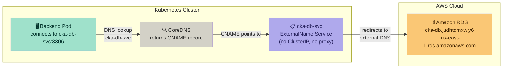

### Step-by-Step Request Flow

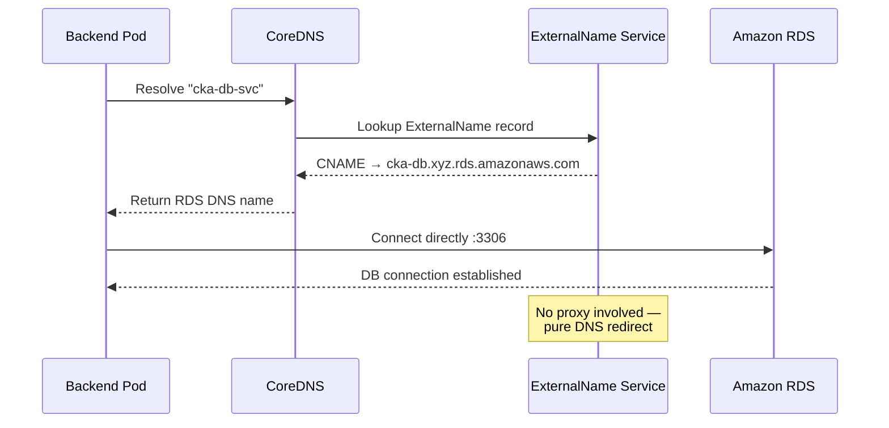

### Why This Is Useful

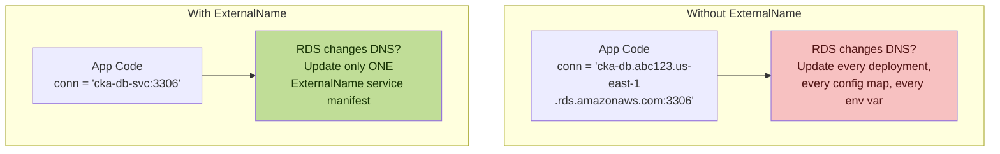

### Key Characteristics

| Property | Value |
|---|---|
| Access scope | Internal → External |
| Mechanism | CNAME DNS record |
| Proxy | ❌ None |
| ClusterIP | ❌ None |
| Update flexibility | Change only service, not app code |
| Best for | External DBs, legacy APIs, third-party services |

### YAML Manifest

```yaml
# externalname-svc.yaml
apiVersion: v1
kind: Service
metadata:
  name: cka-db-svc
  namespace: default
spec:
  type: ExternalName
  externalName: cka-db.judhtdmxwly6.us-east-1.rds.amazonaws.com
  # No selector needed — no pods targeted
  # No ports needed — DNS passthrough
```

### Deploy & Test
```bash
kubectl apply -f externalname-svc.yaml

# Verify
kubectl get svc cka-db-svc
# NAME         TYPE           CLUSTER-IP   EXTERNAL-IP                                    PORT(S)   AGE
# cka-db-svc   ExternalName   <none>       cka-db.judhtdmxwly6.us-east-1.rds.amazonaws.com   <none>    5s

# Test DNS resolution from inside a pod
kubectl run dns-test --image=busybox --rm -it --restart=Never -- sh
nslookup cka-db-svc
# Returns CNAME pointing to RDS endpoint

# App connects using internal name — Kubernetes handles the rest
mysql -h cka-db-svc -P 3306 -u admin -p
```

---

## 6. Service Comparison Summary

### All Four Service Types Side-by-Side

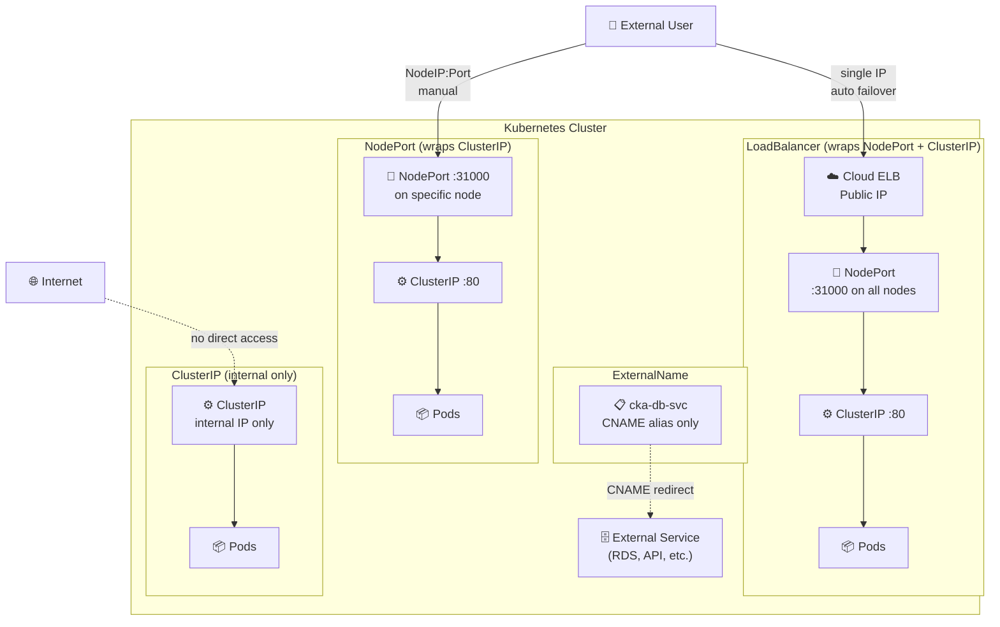

### Quick Reference Table

| Feature | ClusterIP | NodePort | LoadBalancer | ExternalName |
|---|---|---|---|---|
| External access | ❌ | ✅ | ✅ | ❌ (outbound) |
| Single public IP | ❌ | ❌ | ✅ | N/A |
| Auto failover | N/A | ❌ Manual | ✅ Auto | N/A |
| Port range | Any | 30000-32767 | Any | N/A |
| DNS resolution | Internal | Internal | Internal | CNAME |
| Cloud LB cost | No | No | Yes | No |
| Built on | — | ClusterIP | NodePort+CIP | DNS only |
| Best for | Pod-to-pod | Dev/testing | Production | External services |

### Complete Request Flow Comparison

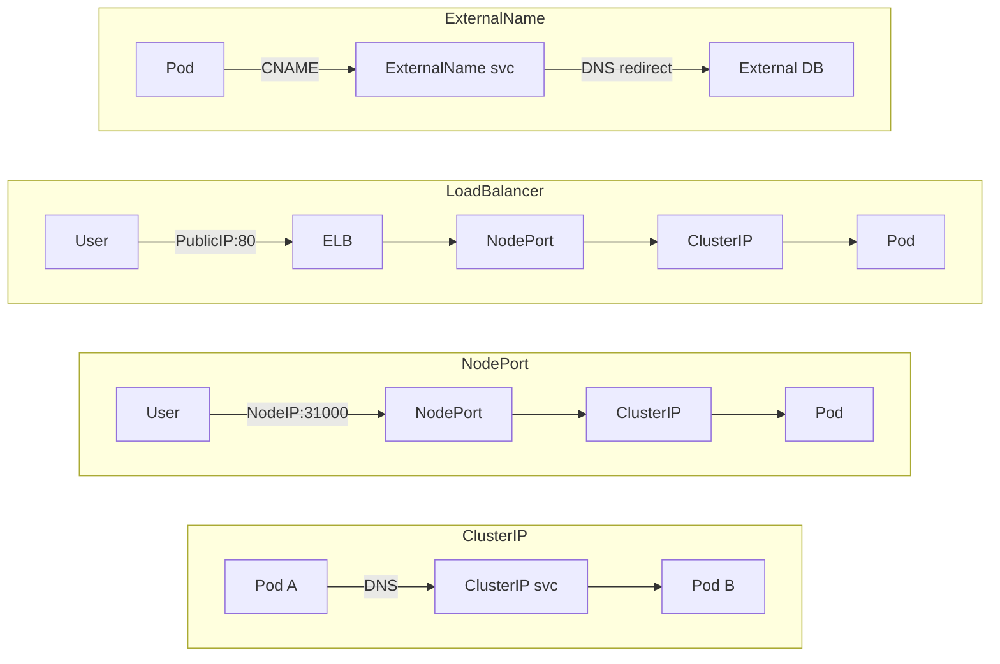

---

## References

- [KIND Extra Port Mappings](https://kind.sigs.k8s.io/docs/user/configuration/#extra-port-mappings)
- [Kubernetes Services Documentation](https://kubernetes.io/docs/concepts/services-networking/service/)
- [CoreDNS in Kubernetes](https://kubernetes.io/docs/concepts/services-networking/dns-pod-service/)
