# Day 13: Imperative Commands — Deployments, Services & Troubleshooting
## Senior Engineer Practical Guide | CKA Course 2025

> 📺 [Watch the video](https://www.youtube.com/watch?v=ZDFqVFbX0Ic&ab_channel=CloudWithVarJosh)

---

## Table of Contents

1. [Why Imperative Commands Matter in Real Production](#1-why-imperative-commands-matter-in-real-production)
2. [dry-run Deep Dive — Client vs Server](#2-dry-run-deep-dive--client-vs-server)
3. [Backend — Deployment + ClusterIP Service](#3-backend--deployment--clusterip-service)
4. [Frontend — Deployment + NodePort Service](#4-frontend--deployment--nodeport-service)
5. [Full Architecture — How Everything Communicates](#5-full-architecture--how-everything-communicates)
6. [Labels — What Senior Engineers Know](#6-labels--what-senior-engineers-know)
7. [Test Pods for Troubleshooting](#7-test-pods-for-troubleshooting)
8. [Real-World Troubleshooting Workflows](#8-real-world-troubleshooting-workflows)
9. [Imperative vs Declarative — When to Use What](#9-imperative-vs-declarative--when-to-use-what)
10. [Key Takeaways](#10-key-takeaways)

---

## 1. Why Imperative Commands Matter in Real Production

In a real job, you will switch between imperative and declarative constantly. Here is when each is used:

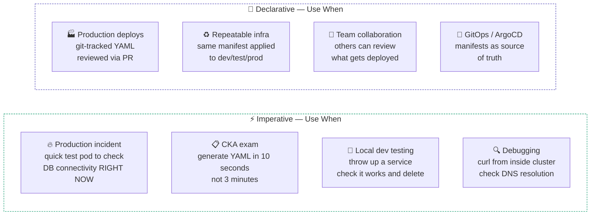

> **Senior engineer mindset:** Use imperative to *generate* the YAML fast, then commit the YAML to git. Best of both worlds.

---

## 2. dry-run Deep Dive — Client vs Server

Understanding `--dry-run` properly separates juniors from seniors.

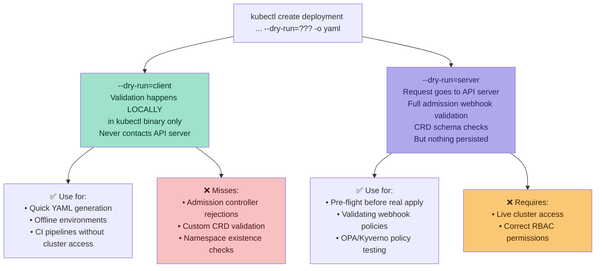

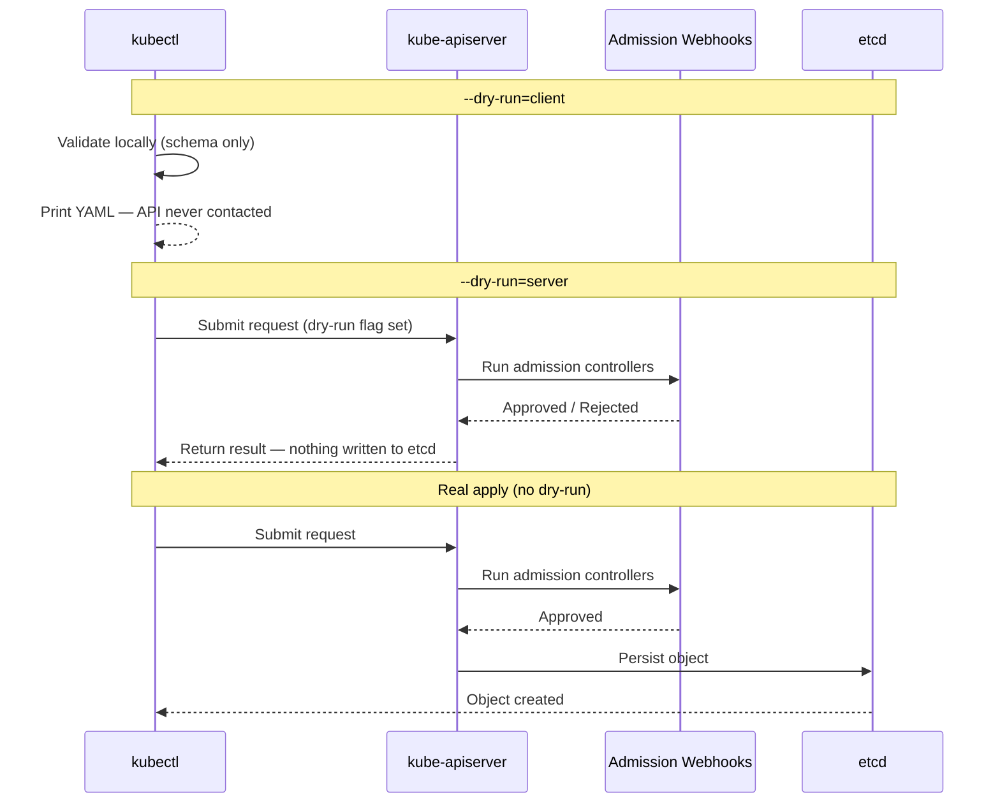

### Real-World Example — Catching a Policy Violation

```bash
# --dry-run=client passes (kubectl doesn't know your OPA policies)
kubectl create deployment test --image=nginx --dry-run=client -o yaml
# ✅ Outputs YAML — looks fine locally

# --dry-run=server catches the Kyverno/OPA policy rejection
kubectl create deployment test --image=nginx --dry-run=server
# ❌ Error: admission webhook "kyverno.io" denied: image must use digest, not tag

# This saves you from a failed real deployment
```

---

## 3. Backend — Deployment + ClusterIP Service

### What ClusterIP Means in Practice

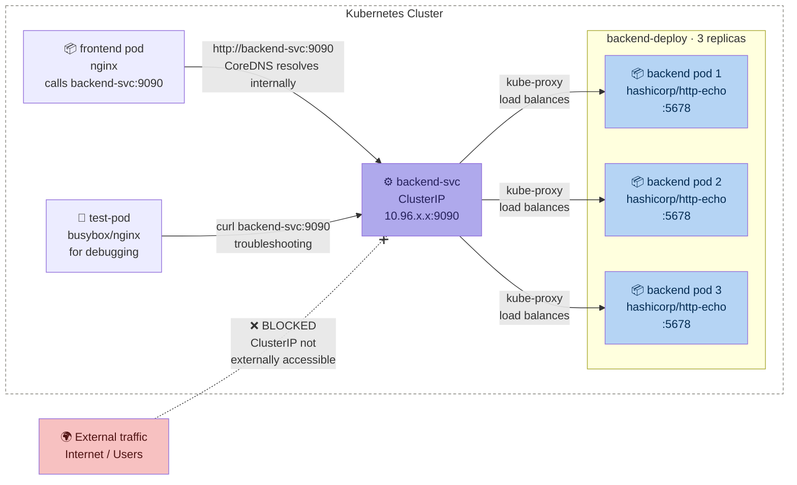

### Port Mapping — What Each Port Means

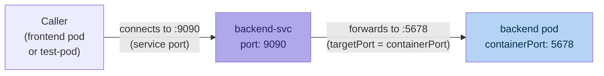

> **Senior tip:** `port` (9090) is what callers use. `targetPort` (5678) is what the container actually listens on. They don't need to match — and often shouldn't, to allow service-layer flexibility.

### Step 1 — Generate backend YAML imperatively

```bash
# Generate the deployment YAML — does NOT create anything yet
kubectl create deployment backend-deploy \
  --image=hashicorp/http-echo \
  --replicas=3 \
  --port=5678 \
  --dry-run=client -o yaml > backend-deploy.yaml
```

**What each flag does in a real context:**

| Flag | Value | Why |
|---|---|---|
| `--image` | `hashicorp/http-echo` | Lightweight HTTP server — responds with static text. Perfect for API mock |
| `--replicas` | `3` | HA baseline — survive 1 pod crash with 2 still serving |
| `--port` | `5678` | Documents the container port in the spec (informational, not enforced) |
| `--dry-run=client` | — | No cluster call — just prints YAML to stdout |
| `-o yaml > file` | — | Redirect to file for editing before applying |

### Step 2 — Append service to same file

```bash
kubectl expose deployment backend-deploy \
  --type=ClusterIP \
  --port=9090 \
  --target-port=5678 \
  --name=backend-svc \
  --dry-run=client -o yaml >> backend-deploy.yaml
```

> Note: `>>` appends (adds to end of file). `>` overwrites. Use `>>` here because the deployment is already in the file.

### Step 3 — Manual edits required (what kubectl cannot do imperatively)

```bash
# Open the file and make these 3 edits:
vim backend-deploy.yaml
```

**Edit 1:** Add `---` separator between deployment and service objects

**Edit 2:** Add the `args` field to make http-echo respond with a message

**Edit 3:** Clean up any auto-generated `status: {}` and `creationTimestamp: null` fields (optional but clean)

### Final `backend-deploy.yaml` (from your uploaded file)

```yaml
apiVersion: apps/v1
kind: Deployment
metadata:
  name: backend-deploy
spec:
  replicas: 3
  selector:
    matchLabels:
      app: backend
  template:
    metadata:
      labels:
        app: backend
    spec:
      containers:
        - image: hashicorp/http-echo
          name: http-echo
          ports:
            - containerPort: 5678     # ← what the container listens on
          args:
            - "-text=Hello from Backend"   # ← manually added after dry-run

---

apiVersion: v1
kind: Service
metadata:
  name: backend-svc
spec:
  ports:
  - port: 9090           # ← what callers use
    protocol: TCP
    targetPort: 5678     # ← forwarded to container port
  selector:
    app: backend         # ← matches pod label app: backend
  type: ClusterIP        # ← internal only, no external access
```

### Apply & Verify

```bash
# Apply both deployment and service from one file
kubectl apply -f backend-deploy.yaml

# Verify deployment
kubectl get deployment backend-deploy
# NAME             READY   UP-TO-DATE   AVAILABLE
# backend-deploy   3/3     3            3

# Verify pods with labels visible
kubectl get pods --show-labels -l app=backend
# NAME                              READY   STATUS    LABELS
# backend-deploy-xxx-aaa            1/1     Running   app=backend,pod-template-hash=xxx
# backend-deploy-xxx-bbb            1/1     Running   app=backend,pod-template-hash=xxx
# backend-deploy-xxx-ccc            1/1     Running   app=backend,pod-template-hash=xxx

# Verify service and ClusterIP assigned
kubectl get svc backend-svc
# NAME          TYPE        CLUSTER-IP      PORT(S)    AGE
# backend-svc   ClusterIP   10.96.26.155    9090/TCP   10s

# Describe to see endpoint mapping
kubectl describe svc backend-svc
# Port:       9090/TCP
# TargetPort: 5678/TCP
# Endpoints:  10.244.1.5:5678, 10.244.2.8:5678, 10.244.3.3:5678
```

---

## 4. Frontend — Deployment + NodePort Service

### What NodePort Means in Practice

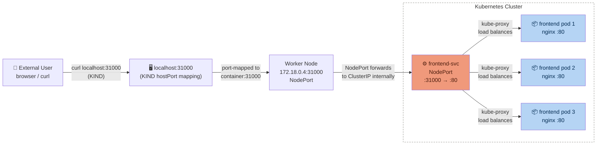

### NodePort Port Mapping Breakdown

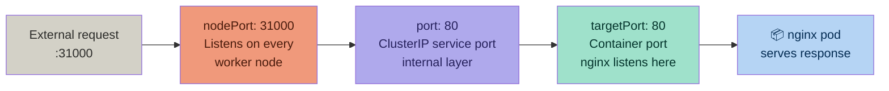

### Step 1 — Generate frontend YAML imperatively

```bash
kubectl create deployment frontend-deploy \
  --image=nginx \
  --replicas=3 \
  --port=80 \
  --dry-run=client -o yaml > frontend-deploy.yaml
```

### Step 2 — Append NodePort service

```bash
kubectl expose deployment frontend-deploy \
  --type=NodePort \
  --port=80 \
  --target-port=80 \
  --name=frontend-svc \
  --dry-run=client -o yaml >> frontend-deploy.yaml
```

> **Important:** `--node-port` flag does NOT exist in `kubectl expose`. You **must** manually add `nodePort: 31000` to the YAML after generation. This is a common CKA trap.

### Step 3 — Manual edits required

```bash
vim frontend-deploy.yaml
# Add --- separator between deployment and service
# Add nodePort: 31000 under the ports section of the service
```

### Final `frontend-deploy.yaml` (from your uploaded file)

```yaml
apiVersion: apps/v1
kind: Deployment
metadata:
  name: frontend-deploy
spec:
  replicas: 3
  selector:
    matchLabels:
      app: frontend
  template:
    metadata:
      labels:
        app: frontend
    spec:
      containers:
        - image: nginx
          name: nginx
          ports:
            - containerPort: 80

---

apiVersion: v1
kind: Service
metadata:
  name: frontend-svc
spec:
  ports:
  - port: 80             # ← ClusterIP layer port
    protocol: TCP
    targetPort: 80       # ← nginx container port
    nodePort: 31000      # ← manually added! cannot set imperatively
  selector:
    app: frontend        # ← matches pod label app: frontend
  type: NodePort         # ← external access via node IP
```

### Apply & Verify

```bash
kubectl apply -f frontend-deploy.yaml

# Verify deployment
kubectl get deployment frontend-deploy
# NAME              READY   UP-TO-DATE   AVAILABLE
# frontend-deploy   3/3     3            3

# Verify NodePort service
kubectl get svc frontend-svc
# NAME           TYPE       CLUSTER-IP      EXTERNAL-IP   PORT(S)        AGE
# frontend-svc   NodePort   10.96.45.120    <none>        80:31000/TCP   5s
#                                                             ↑ port:nodePort format

# Test from your local machine (KIND)
curl http://localhost:31000
# <!DOCTYPE html><html>...nginx welcome page...

# Get node IP for direct NodePort access
kubectl get nodes -o wide
curl http://172.18.0.4:31000
```

---

## 5. Full Architecture — How Everything Communicates

### Complete Request Flow Diagram

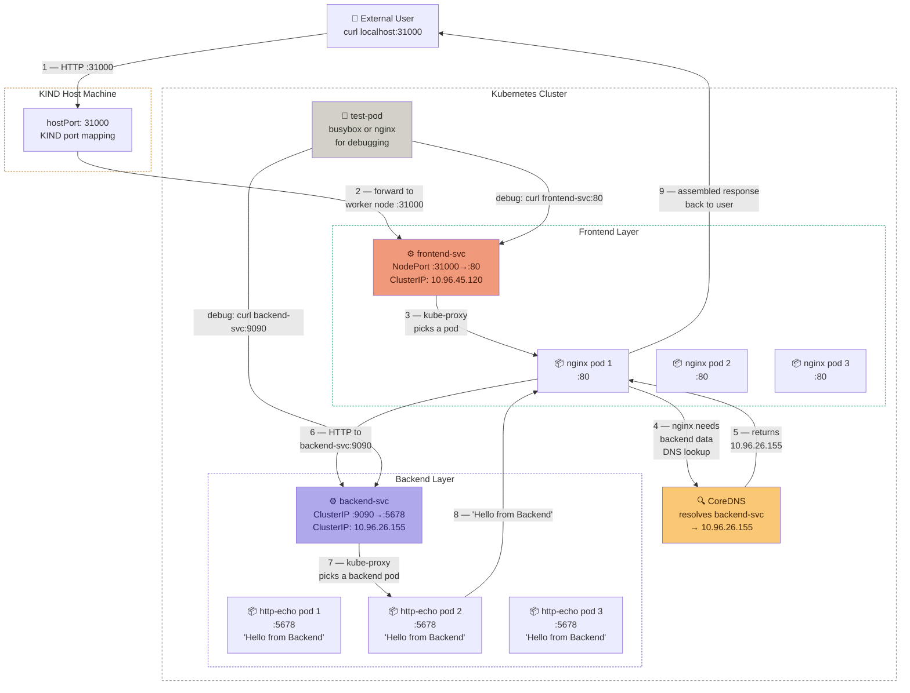

### Sequence Diagram — Full Request Lifecycle

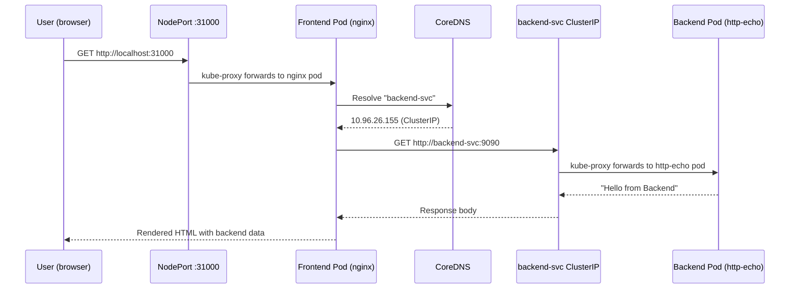

---

## 6. Labels — What Senior Engineers Know

Labels are the glue of Kubernetes. Services find pods using labels. Understanding the full label chain is critical.

### Label Selector Chain

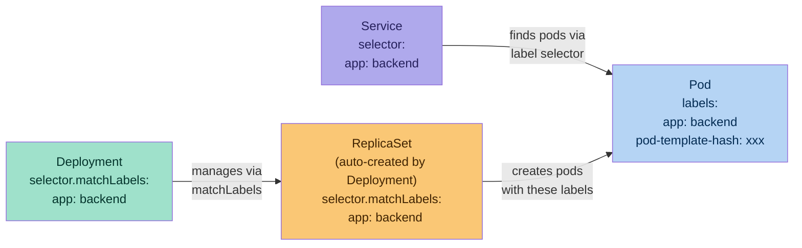

### What You Can and Cannot Do with Labels Imperatively

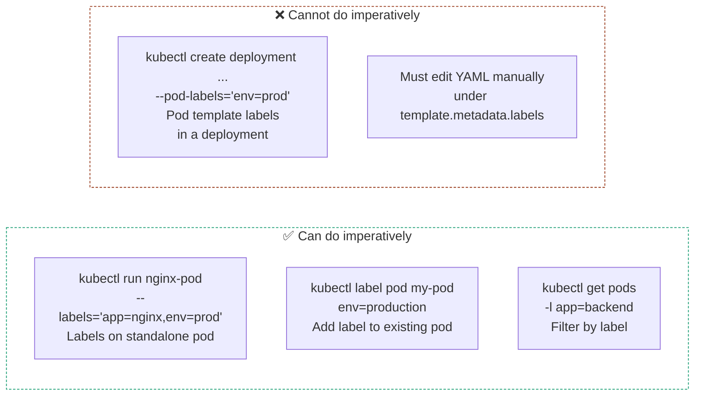

### Creating Pods with Multiple Labels

```bash
# Create a pod with multiple labels imperatively
kubectl run nginx-pod \
  --image=nginx \
  --restart=Never \
  --labels="app=nginx,env=production,tier=frontend"

# Verify labels
kubectl get pods --show-labels
# NAME        READY   STATUS    LABELS
# nginx-pod   1/1     Running   app=nginx,env=production,tier=frontend

# Filter by a single label
kubectl get pods -l env=production

# Filter by multiple labels (AND logic)
kubectl get pods -l app=nginx,env=production

# Filter using set-based selector
kubectl get pods -l 'env in (production, staging)'

# Show which pods a service is targeting
kubectl get endpoints backend-svc
# NAME          ENDPOINTS
# backend-svc   10.244.1.5:5678,10.244.2.8:5678,10.244.3.3:5678
# ↑ If this is empty, your service selector doesn't match any pod labels
```

> **Senior debug tip:** If a service has no Endpoints, the label selector doesn't match. Always check `kubectl get endpoints <svc-name>` before chasing networking issues.

---

## 7. Test Pods for Troubleshooting

### When and Why to Use Test Pods

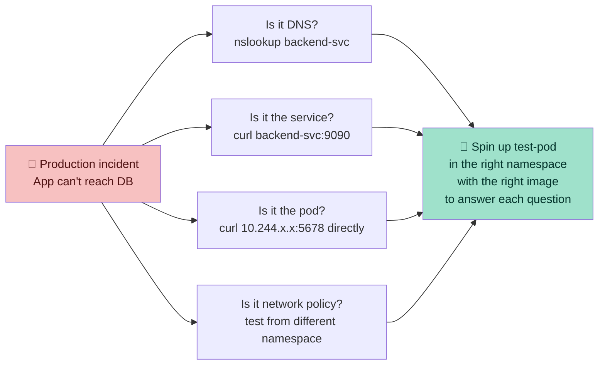

### Generate Test Pod YAML Quickly

```bash
# Generate test pod YAML (useful for CKA)
kubectl run my-nginx \
  --image=nginx \
  --restart=Never \
  --labels=app=test-pod \
  --dry-run=client -o yaml > test-pod.yaml

# Review it
cat test-pod.yaml
```

Output:
```yaml
apiVersion: v1
kind: Pod
metadata:
  labels:
    app: test-pod
  name: my-nginx
spec:
  containers:
  - image: nginx
    name: my-nginx
  restartPolicy: Never
```

### Temporary Interactive Pod — Most Used in Production

```bash
# Spin up busybox — lightweight, has wget, nslookup, ping
kubectl run test-pod \
  --rm -it \
  --restart=Never \
  --image=busybox \
  -- /bin/sh

# Inside the pod — run your checks:
nslookup backend-svc              # DNS resolution
wget -qO- http://backend-svc:9090 # HTTP check
wget -qO- http://frontend-svc:80  # Frontend check
ping 10.244.1.5                   # Direct pod IP ping
exit  # ← pod auto-deleted because of --rm
```

```bash
# Use nginx instead if you need curl (busybox wget vs curl)
kubectl run test-pod \
  --rm -it \
  --restart=Never \
  --image=nginx \
  -- /bin/bash

# Inside:
curl http://backend-svc:9090
curl http://backend-svc.default.svc.cluster.local:9090  # FQDN
exit
```

### Test Pod Communication Flow

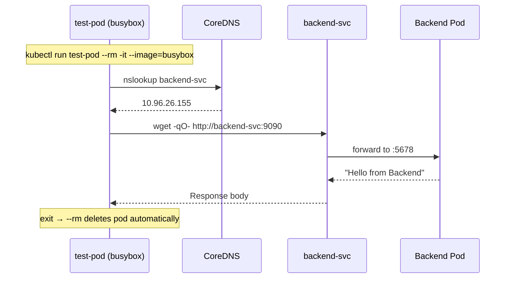

---

## 8. Real-World Troubleshooting Workflows

### Workflow 1 — Service Not Reachable

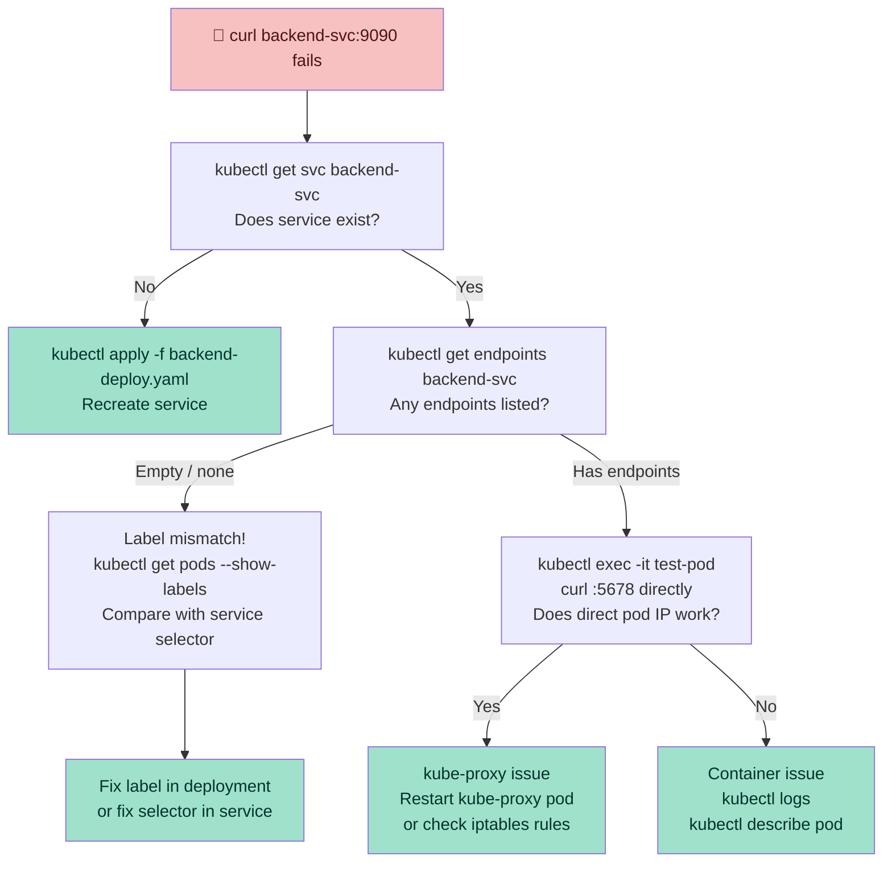

### Workflow 2 — NodePort Not Accessible from Outside

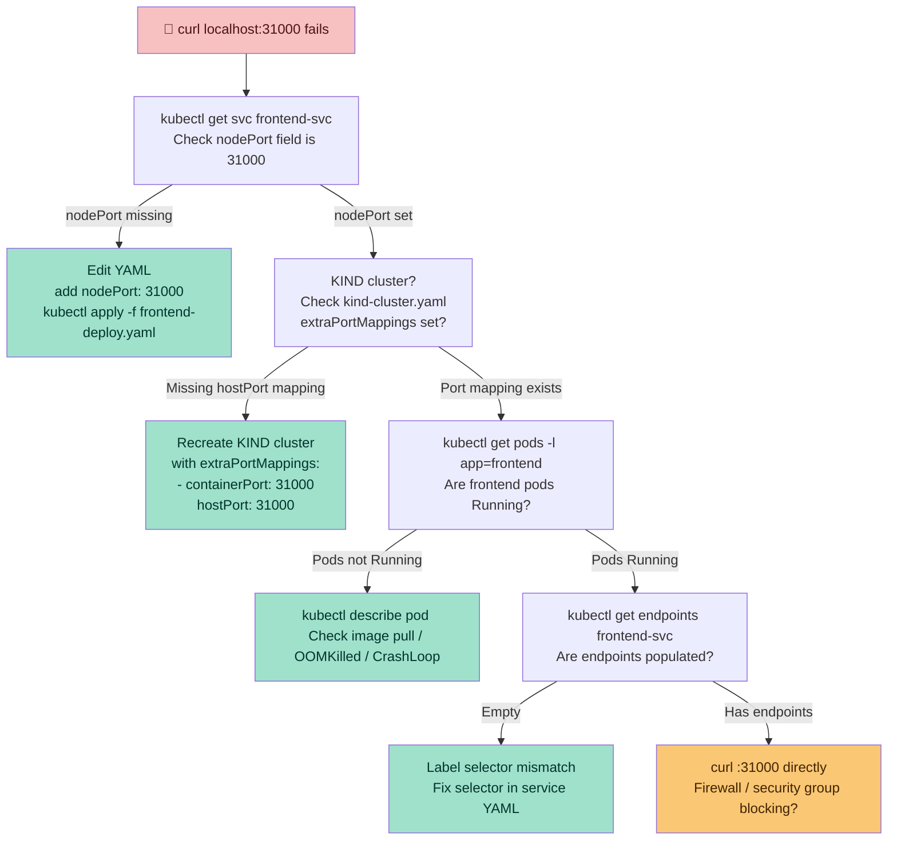

### Cheat Sheet — Senior Debug Commands

```bash
# ── SERVICE DEBUGGING ─────────────────────────────────────
# Does the service exist and what type?
kubectl get svc -A

# Are pods actually being targeted?
kubectl get endpoints backend-svc
# Empty = label mismatch between service selector and pod labels

# What labels do pods have?
kubectl get pods --show-labels -l app=backend

# Does the service selector match?
kubectl describe svc backend-svc | grep -A3 Selector

# ── POD DEBUGGING ─────────────────────────────────────────
# Check pod status
kubectl get pods -o wide

# Check events (crash reasons, image pull failures)
kubectl describe pod <pod-name> | tail -20

# Check logs
kubectl logs <pod-name>
kubectl logs <pod-name> --previous   # previous container (after crash)

# ── NETWORK DEBUGGING ─────────────────────────────────────
# Exec into a running pod
kubectl exec -it <pod-name> -- /bin/sh

# One-liner network test without entering pod
kubectl exec -it <frontend-pod> -- curl http://backend-svc:9090

# DNS check
kubectl exec -it <any-pod> -- nslookup backend-svc

# Direct pod IP bypass (skips service layer)
kubectl exec -it <any-pod> -- curl http://10.244.1.5:5678
```

---

## 9. Imperative vs Declarative — When to Use What

### The Recommended Senior Workflow

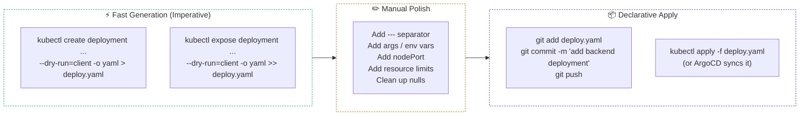

### Things You Always Need to Add Manually After `--dry-run`

| What | Why kubectl can't do it |
|---|---|
| `---` YAML separator | `>>` appends without separator |
| `args:` in container spec | `kubectl create deployment` has no `--args` flag |
| `nodePort: 31000` | `kubectl expose` has no `--node-port` flag |
| `resources.requests/limits` | Not exposed as a flag in create/expose |
| `env:` variables | `kubectl create deployment` has `--env` but limited support |
| `namespace: app1-ns` in metadata | Must be specified with `-n` flag or added manually |
| `imagePullPolicy` | Not a flag — manual edit |
| `livenessProbe / readinessProbe` | Not a flag — manual edit |

---

## 10. Key Takeaways

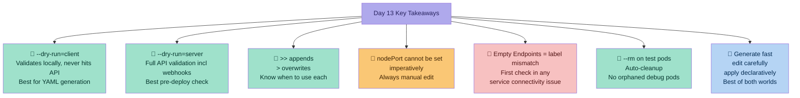

---

## Appendix — Uploaded YAML Files Reference

### `backend-deploy.yaml`
```yaml
apiVersion: apps/v1
kind: Deployment
metadata:
  name: backend-deploy
spec:
  replicas: 3
  selector:
    matchLabels:
      app: backend
  template:
    metadata:
      labels:
        app: backend
    spec:
      containers:
        - image: hashicorp/http-echo
          name: http-echo
          ports:
            - containerPort: 5678
          args:
            - "-text=Hello from Backend"

---

apiVersion: v1
kind: Service
metadata:
  name: backend-svc
spec:
  ports:
  - port: 9090
    protocol: TCP
    targetPort: 5678
  selector:
    app: backend
  type: ClusterIP
```

### `frontend-deploy.yaml`
```yaml
apiVersion: apps/v1
kind: Deployment
metadata:
  name: frontend-deploy
spec:
  replicas: 3
  selector:
    matchLabels:
      app: frontend
  template:
    metadata:
      labels:
        app: frontend
    spec:
      containers:
        - image: nginx
          name: nginx
          ports:
            - containerPort: 80

---

apiVersion: v1
kind: Service
metadata:
  name: frontend-svc
spec:
  ports:
  - port: 80
    protocol: TCP
    targetPort: 80
    nodePort: 31000
  selector:
    app: frontend
  type: NodePort
```

---

## References
- [kubectl Cheat Sheet](https://kubernetes.io/docs/reference/kubectl/cheatsheet/)
- [kubectl create deployment](https://kubernetes.io/docs/reference/generated/kubectl/kubectl-commands#-em-deployment-em-)
- [kubectl expose](https://kubernetes.io/docs/reference/generated/kubectl/kubectl-commands#expose)
- [Kubernetes Services](https://kubernetes.io/docs/concepts/services-networking/service/)
