# Day 14: Kubernetes Namespaces Explained
## Isolation & Resource Management | CKA Course 2025

> 📺 [Watch the video](https://www.youtube.com/watch?v=uDlhbtGy1AU&ab_channel=CloudWithVarJosh)

---

## Table of Contents

1. [What Are Namespaces?](#1-what-are-namespaces)
2. [Default Namespaces in Kubernetes](#2-default-namespaces-in-kubernetes)
3. [Namespace Isolation — How It Works](#3-namespace-isolation--how-it-works)
4. [Cross-Namespace Communication](#4-cross-namespace-communication)
5. [Working with Namespaces](#5-working-with-namespaces)
6. [Deploying Frontend & Backend in a Namespace](#6-deploying-frontend--backend-in-a-namespace)
7. [Testing Namespace Isolation](#7-testing-namespace-isolation)
8. [Setting a Default Namespace](#8-setting-a-default-namespace)
9. [Best Practices](#9-best-practices)
10. [Summary](#10-summary)

---

## 1. What Are Namespaces?

A **namespace** is a logical partition inside a Kubernetes cluster. Think of it as creating separate rooms in a large shared house — each family (workload) gets its own private space.

### The House Analogy

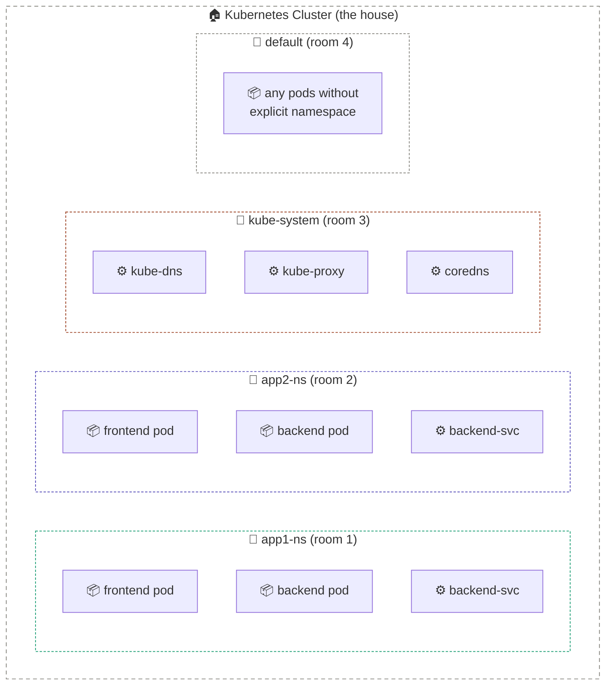

> Without namespaces = all families in one open room → no privacy, naming conflicts, no resource control.
> With namespaces = each family has its own room → isolation, security, organisation.

### Why Use Namespaces?

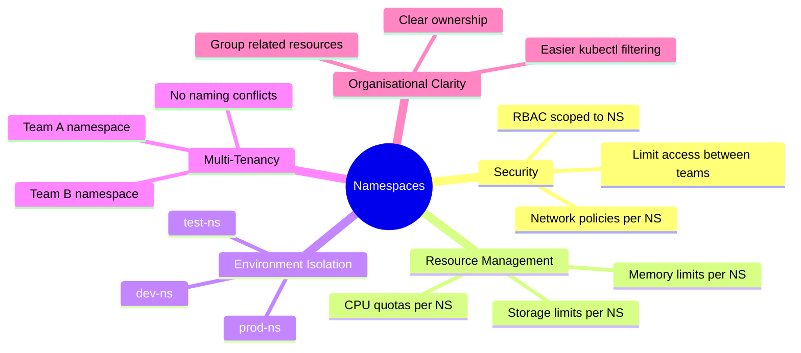

---

## 2. Default Namespaces in Kubernetes

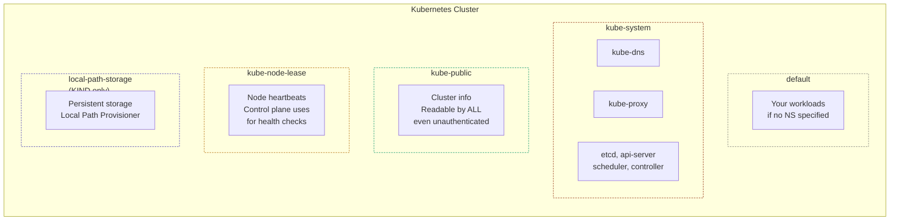

| Namespace | Purpose | Touch it? |
|---|---|---|
| `default` | Your workloads go here if no NS is specified | ✅ Yes, for dev/testing |
| `kube-system` | Kubernetes control plane components | ❌ Never modify |
| `kube-public` | Publicly readable cluster info | ❌ Read-only |
| `kube-node-lease` | Node heartbeat objects | ❌ Never modify |
| `local-path-storage` | KIND persistent storage (KIND clusters only) | ❌ Leave alone |

```bash
# See all default namespaces
kubectl get namespaces

# NAME                 STATUS   AGE
# default              Active   2d
# kube-node-lease      Active   2d
# kube-public          Active   2d
# kube-system          Active   2d
# local-path-storage   Active   2d   ← KIND only
```

---

## 3. Namespace Isolation — How It Works

### Same Name, Different Namespace — No Conflict

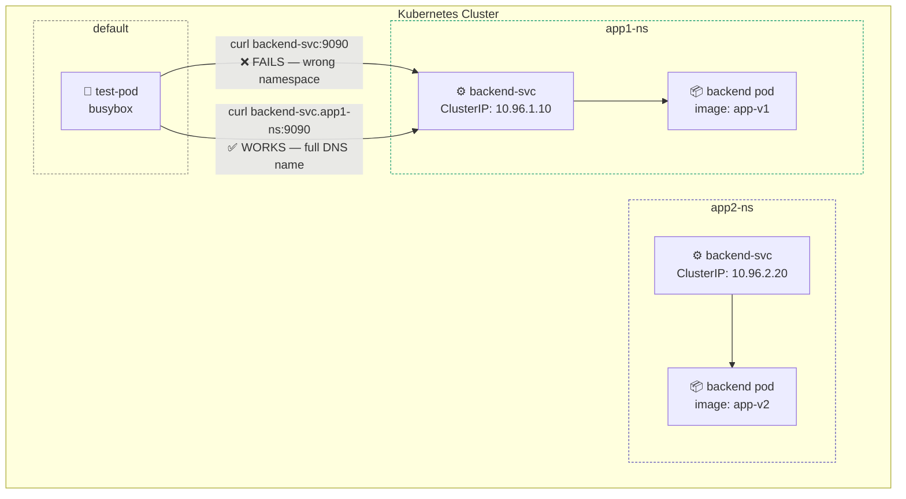

> Both namespaces have a service called `backend-svc` — they don't conflict because they live in separate namespaces.

### Resource Isolation Model

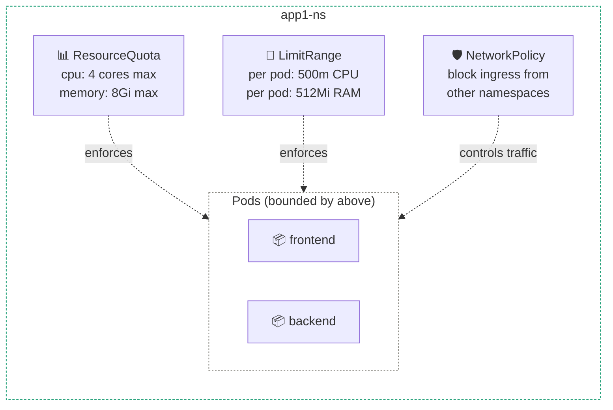

---

## 4. Cross-Namespace Communication

### DNS Format for Cross-Namespace Access

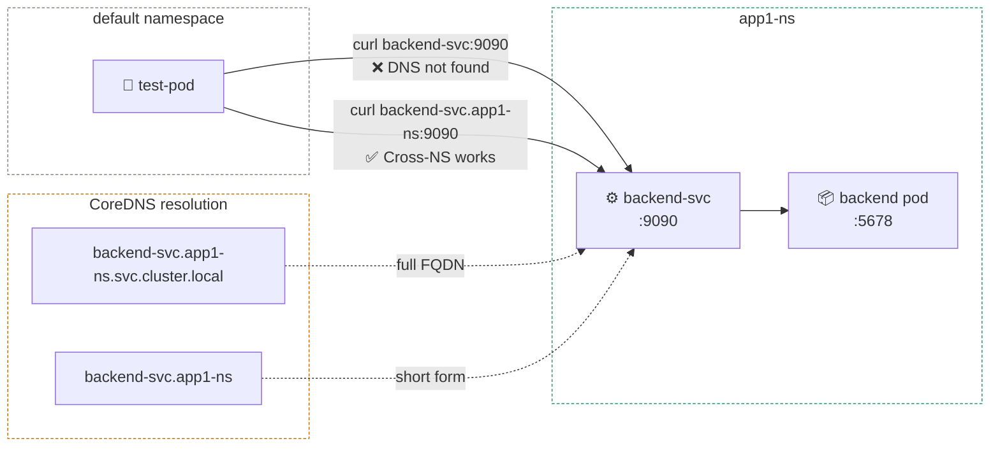

### DNS Name Format Breakdown

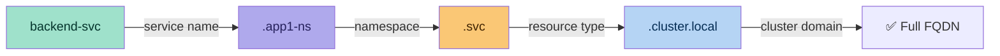

| Scope | Format | Example |
|---|---|---|
| Same namespace | `<service-name>:<port>` | `backend-svc:9090` |
| Cross-namespace (short) | `<service>.<namespace>:<port>` | `backend-svc.app1-ns:9090` |
| Full FQDN | `<service>.<namespace>.svc.cluster.local` | `backend-svc.app1-ns.svc.cluster.local` |

---

## 5. Working with Namespaces

### Create a Namespace

#### Imperative (quick)
```bash
kubectl create namespace app1-ns
```

#### Declarative (recommended for production)
```yaml
# app1-ns.yaml
apiVersion: v1
kind: Namespace
metadata:
  name: app1-ns
  labels:
    team: backend
    environment: dev
```
```bash
kubectl apply -f app1-ns.yaml
```

### View, Describe, Delete

```bash
# List all namespaces
kubectl get namespaces
kubectl get ns                     # short alias

# Describe a namespace
kubectl describe namespace app1-ns

# Delete namespace (⚠️ deletes ALL resources inside!)
kubectl delete namespace app1-ns
```

> **Warning:** `kubectl delete namespace app1-ns` removes every pod, service, configmap, secret, and deployment inside it. There is no confirmation prompt.

### Namespace Flags Reference

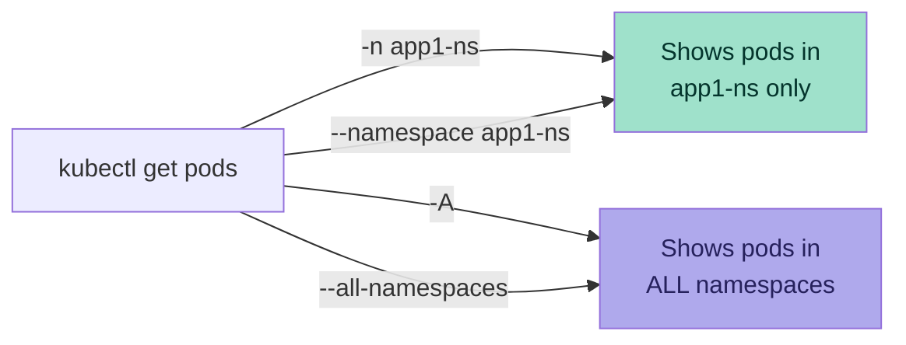

```bash
# Pods in a specific namespace
kubectl get pods -n app1-ns
kubectl get pods --namespace app1-ns

# Pods across ALL namespaces
kubectl get pods -A
kubectl get pods --all-namespaces

# All resources in a namespace
kubectl get all -n app1-ns

# Services across all namespaces
kubectl get services -A
```

---

## 6. Deploying Frontend & Backend in a Namespace

### Architecture

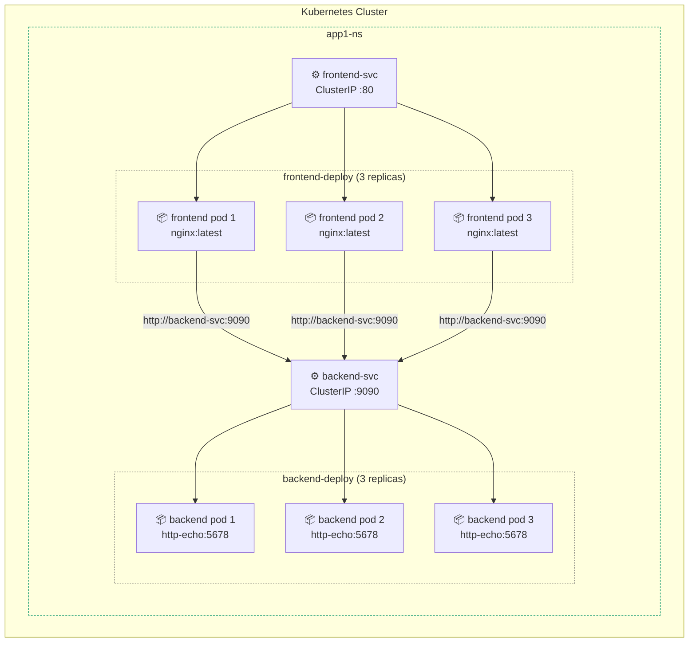

### YAML Manifests

#### Namespace
```yaml
# app1-ns.yaml
apiVersion: v1
kind: Namespace
metadata:
  name: app1-ns
```

#### Frontend Deployment
```yaml
# frontend-deploy.yaml
apiVersion: apps/v1
kind: Deployment
metadata:
  name: frontend-deploy
  namespace: app1-ns        # ← specify namespace here
spec:
  replicas: 3
  selector:
    matchLabels:
      app: frontend
  template:
    metadata:
      labels:
        app: frontend
    spec:
      containers:
        - name: frontend-container
          image: nginx:latest
          ports:
            - containerPort: 80
```

#### Backend Deployment
```yaml
# backend-deploy.yaml
apiVersion: apps/v1
kind: Deployment
metadata:
  name: backend-deploy
  namespace: app1-ns        # ← specify namespace here
spec:
  replicas: 3
  selector:
    matchLabels:
      app: backend
  template:
    metadata:
      labels:
        app: backend
    spec:
      containers:
        - name: backend-container
          image: hashicorp/http-echo
          args:
            - "-text=Hello from Backend in app1-ns"
```

#### Backend ClusterIP Service
```yaml
# backend-svc.yaml
apiVersion: v1
kind: Service
metadata:
  name: backend-svc
  namespace: app1-ns        # ← specify namespace here
spec:
  type: ClusterIP
  ports:
    - protocol: TCP
      port: 9090
      targetPort: 5678
  selector:
    app: backend
```

### Deploy Commands

```bash
# Step 1: Create the namespace first
kubectl apply -f app1-ns.yaml

# Step 2: Deploy everything into app1-ns
kubectl apply -f frontend-deploy.yaml -n app1-ns
kubectl apply -f backend-deploy.yaml  -n app1-ns
kubectl apply -f backend-svc.yaml     -n app1-ns

# OR — if namespace is in the YAML metadata, just apply directly
kubectl apply -f frontend-deploy.yaml
kubectl apply -f backend-deploy.yaml
kubectl apply -f backend-svc.yaml

# Step 3: Verify everything is running
kubectl get all -n app1-ns

# Expected output:
# NAME                                   READY   STATUS    RESTARTS   AGE
# pod/backend-deploy-xxx-yyy             1/1     Running   0          30s
# pod/frontend-deploy-xxx-yyy            1/1     Running   0          30s
# NAME                  TYPE        CLUSTER-IP      PORT(S)    AGE
# service/backend-svc   ClusterIP   10.96.26.155    9090/TCP   30s
```

---

## 7. Testing Namespace Isolation

### Isolation Test Flow

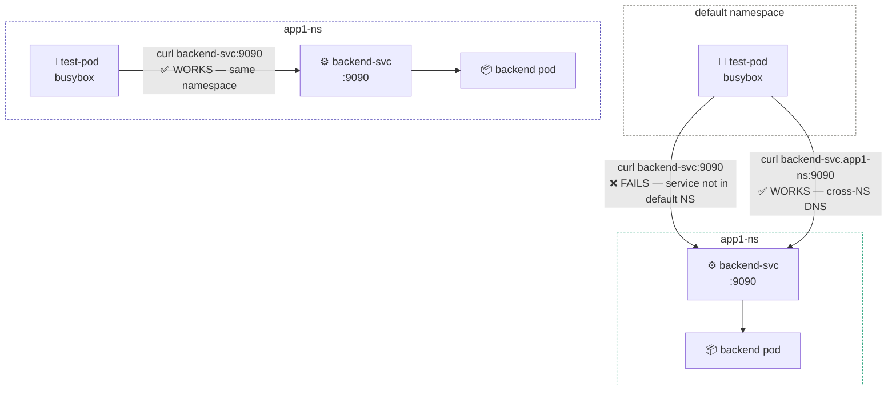

### Test 1 — From `default` Namespace (cross-namespace)

```bash
# Launch a test pod in the default namespace
kubectl run test-pod --image=busybox -it --rm --restart=Never -- /bin/sh

# Inside the pod:
curl backend-svc:9090
# ❌ curl: (6) Could not resolve host: backend-svc
# Reason: backend-svc lives in app1-ns, not default

curl http://backend-svc.app1-ns:9090
# ✅ Hello from Backend in app1-ns
# Format: <service-name>.<namespace>:<port>
```

### Test 2 — From `app1-ns` (same namespace)

```bash
# Launch a test pod inside app1-ns
kubectl run test-pod -n app1-ns --image=busybox -it --rm --restart=Never -- /bin/sh

# Inside the pod:
curl backend-svc:9090
# ✅ Hello from Backend in app1-ns
# Works — test-pod and backend-svc are in the same namespace
```

### Summary of Isolation Tests

| Test | Command | Result | Reason |
|---|---|---|---|
| Same NS | `curl backend-svc:9090` | ✅ Works | Service found via short DNS |
| Cross NS (wrong) | `curl backend-svc:9090` from default | ❌ Fails | DNS only resolves within same NS |
| Cross NS (correct) | `curl backend-svc.app1-ns:9090` | ✅ Works | Full namespace-scoped DNS |
| Full FQDN | `curl backend-svc.app1-ns.svc.cluster.local:9090` | ✅ Works | Always works from anywhere |

---

## 8. Setting a Default Namespace

### The Problem Without a Default

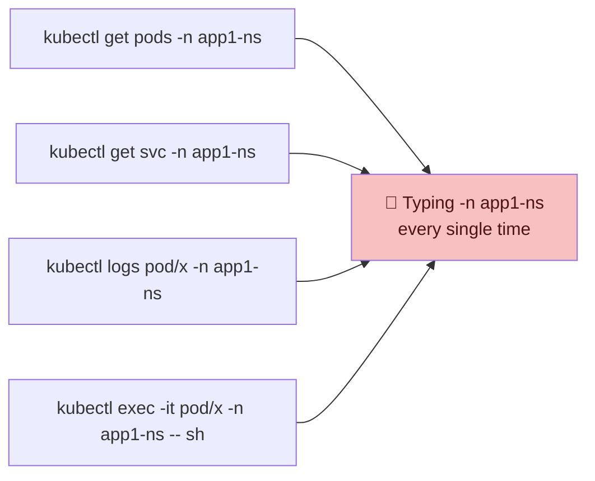

### The Fix — Set Context Default Namespace

```bash
# Set app1-ns as the default namespace for your current context
kubectl config set-context --current --namespace=app1-ns

# Verify the change
kubectl config get-contexts
# CURRENT   NAME                 CLUSTER   AUTHINFO   NAMESPACE
# *         kind-my-cluster      kind      kind       app1-ns   ← updated

# Now these work WITHOUT -n app1-ns
kubectl get pods          # shows app1-ns pods
kubectl get svc           # shows app1-ns services
kubectl get all           # shows everything in app1-ns
```

### How Context Default Namespace Works

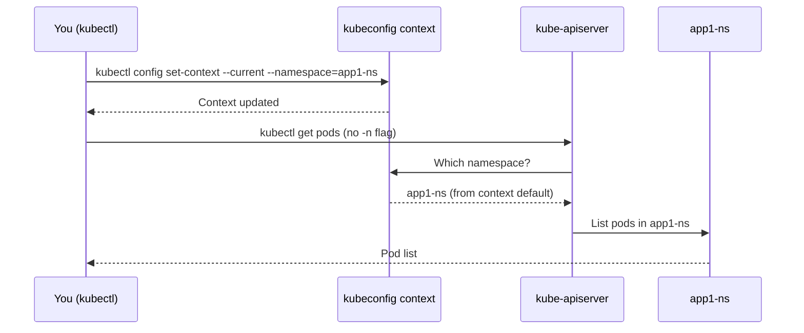

```bash
# Reset back to default namespace
kubectl config set-context --current --namespace=default

# Check current active namespace
kubectl config view --minify | grep namespace
```

---

## 9. Best Practices

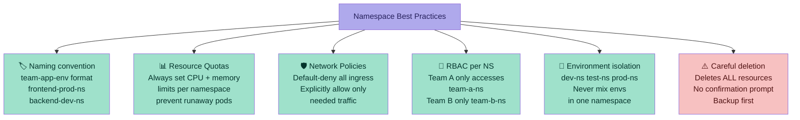

### ResourceQuota Example (per namespace)
```yaml
# resource-quota.yaml
apiVersion: v1
kind: ResourceQuota
metadata:
  name: app1-quota
  namespace: app1-ns
spec:
  hard:
    requests.cpu: "4"
    requests.memory: 8Gi
    limits.cpu: "8"
    limits.memory: 16Gi
    pods: "20"
```

```bash
kubectl apply -f resource-quota.yaml
kubectl describe resourcequota app1-quota -n app1-ns
```

---

## 10. Summary

### Complete Namespace Communication Map

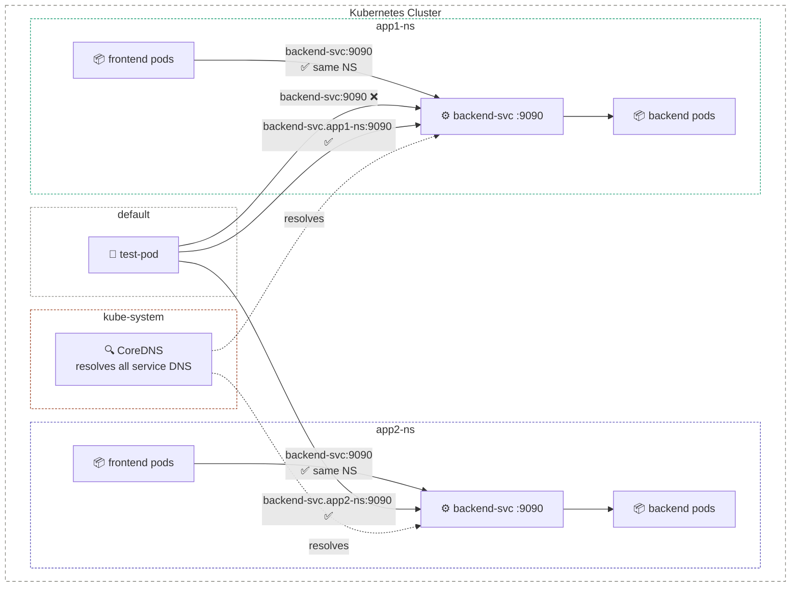

### Key Takeaways

| Concept | Key Point |
|---|---|
| Namespace = logical room | Isolates resources, names, and access within a cluster |
| Same NS DNS | `service-name:port` — short form works |
| Cross NS DNS | `service.namespace:port` — namespace scope required |
| Full FQDN | `service.namespace.svc.cluster.local` — always works |
| Default context NS | `kubectl config set-context --current --namespace=X` |
| Deletion warning | `kubectl delete namespace` removes ALL resources inside |
| kube-system | Never touch — holds control plane components |

---

## References
- [Kubernetes Namespaces Documentation](https://kubernetes.io/docs/concepts/overview/working-with-objects/namespaces/)
- [ResourceQuota Documentation](https://kubernetes.io/docs/concepts/policy/resource-quotas/)
- [NetworkPolicy Documentation](https://kubernetes.io/docs/concepts/services-networking/network-policies/)
