# Day 14: Kubernetes Namespaces Explained
## Senior Engineer Practical Guide | Isolation & Resource Management | CKA Course 2025

> 📺 [Watch the video](https://www.youtube.com/watch?v=uDlhbtGy1AU&ab_channel=CloudWithVarJosh)

---

## Table of Contents

1. [What Are Namespaces — Senior Perspective](#1-what-are-namespaces--senior-perspective)
2. [Default Namespaces in Kubernetes](#2-default-namespaces-in-kubernetes)
3. [Namespace Isolation — How It Really Works](#3-namespace-isolation--how-it-really-works)
4. [Cross-Namespace Communication — DNS Deep Dive](#4-cross-namespace-communication--dns-deep-dive)
5. [Working with Namespaces](#5-working-with-namespaces)
6. [Deploying Frontend & Backend in app1-ns](#6-deploying-frontend--backend-in-app1-ns)
7. [Full Architecture — How Everything Communicates](#7-full-architecture--how-everything-communicates)
8. [Testing Namespace Isolation](#8-testing-namespace-isolation)
9. [Setting a Default Namespace](#9-setting-a-default-namespace)
10. [Real-World Troubleshooting Workflows](#10-real-world-troubleshooting-workflows)
11. [Best Practices — Production Grade](#11-best-practices--production-grade)
12. [Summary](#12-summary)

---

## 1. What Are Namespaces — Senior Perspective

A **namespace** is a logical partition inside a Kubernetes cluster. It is not a network boundary by default — it is a **naming and access scope boundary**. Network isolation requires explicit NetworkPolicy on top.

### The House Analogy

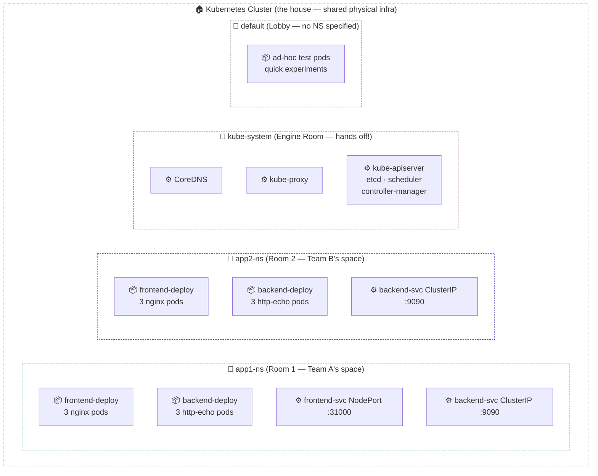
```mermaid
flowchart TB
    subgraph CLUSTER["🏠 Kubernetes Cluster (the house — shared physical infra)"]
        subgraph NS1["🚪 app1-ns (Room 1 — Team A's space)"]
            A1["📦 frontend-deploy\n3 nginx pods"]
            A2["📦 backend-deploy\n3 http-echo pods"]
            A3["⚙️ frontend-svc NodePort :31000"]
            A4["⚙️ backend-svc ClusterIP :9090"]
        end
        subgraph NS2["🚪 app2-ns (Room 2 — Team B's space)"]
            B1["📦 frontend-deploy\n3 nginx pods"]
            B2["📦 backend-deploy\n3 http-echo pods"]
            B3["⚙️ backend-svc ClusterIP :9090"]
        end
        subgraph NS3["🚪 kube-system (Engine Room — hands off!)"]
            C1["⚙️ CoreDNS"]
            C2["⚙️ kube-proxy"]
            C3["⚙️ kube-apiserver\netcd · scheduler\ncontroller-manager"]
        end
        subgraph NS4["🚪 default (Lobby — no NS specified)"]
            D1["📦 ad-hoc test pods\nquick experiments"]
        end
    end

    style CLUSTER fill:transparent,stroke:#888780,stroke-dasharray:5 4
    style NS1 fill:transparent,stroke:#1D9E75,stroke-dasharray:3 2
    style NS2 fill:transparent,stroke:#534AB7,stroke-dasharray:3 2
    style NS3 fill:transparent,stroke:#993C1D,stroke-dasharray:3 2
    style NS4 fill:transparent,stroke:#888780,stroke-dasharray:3 2
```

> **Senior mindset:** Namespaces alone do NOT block network traffic between pods — two pods in different namespaces can still talk to each other unless you add NetworkPolicy. Namespace = naming scope, not firewall.

### Why Use Namespaces — Real Production Reasons

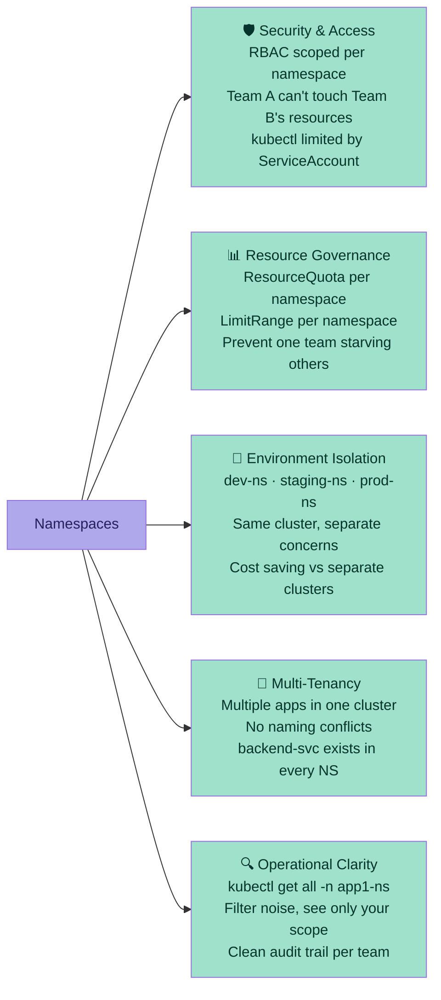
```mermaid
flowchart LR
    NS["Namespaces"]

    NS --> SEC["🛡️ Security & Access\nRBAC scoped per namespace\nTeam A can't touch Team B's resources\nkubectl limited by ServiceAccount"]
    NS --> RES["📊 Resource Governance\nResourceQuota per namespace\nLimitRange per namespace\nPrevent one team starving others"]
    NS --> ENV["🌿 Environment Isolation\ndev-ns · staging-ns · prod-ns\nSame cluster, separate concerns\nCost saving vs separate clusters"]
    NS --> MT["👥 Multi-Tenancy\nMultiple apps in one cluster\nNo naming conflicts\nbackend-svc exists in every NS"]
    NS --> OPS["🔍 Operational Clarity\nkubectl get all -n app1-ns\nFilter noise, see only your scope\nClean audit trail per team"]

    style NS fill:#AFA9EC,color:#26215C
    style SEC fill:#9FE1CB,color:#04342C
    style RES fill:#9FE1CB,color:#04342C
    style ENV fill:#9FE1CB,color:#04342C
    style MT fill:#9FE1CB,color:#04342C
    style OPS fill:#9FE1CB,color:#04342C
```

---

## 2. Default Namespaces in Kubernetes

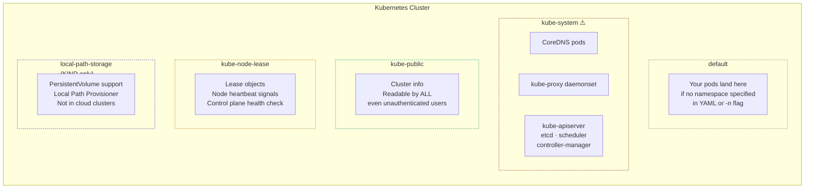
```mermaid
flowchart LR
    subgraph CLUSTER["Kubernetes Cluster"]
        subgraph DEF["default"]
            D["Your pods land here\nif no namespace specified\nin YAML or -n flag"]
        end
        subgraph KS["kube-system ⚠️"]
            KS1["CoreDNS pods"]
            KS2["kube-proxy daemonset"]
            KS3["kube-apiserver\netcd · scheduler\ncontroller-manager"]
        end
        subgraph KP["kube-public"]
            KP1["Cluster info\nReadable by ALL\neven unauthenticated users"]
        end
        subgraph KNL["kube-node-lease"]
            KNL1["Lease objects\nNode heartbeat signals\nControl plane health check"]
        end
        subgraph LPS["local-path-storage\n(KIND only)"]
            LPS1["PersistentVolume support\nLocal Path Provisioner\nNot in cloud clusters"]
        end
    end

    style DEF fill:transparent,stroke:#888780,stroke-dasharray:3 2
    style KS fill:transparent,stroke:#993C1D,stroke-dasharray:3 2
    style KP fill:transparent,stroke:#1D9E75,stroke-dasharray:3 2
    style KNL fill:transparent,stroke:#BA7517,stroke-dasharray:3 2
    style LPS fill:transparent,stroke:#534AB7,stroke-dasharray:3 2
```

| Namespace | Purpose | Rule |
|---|---|---|
| `default` | Workloads with no namespace specified | ✅ Use for dev/testing only |
| `kube-system` | Kubernetes control plane components | ❌ Never modify or deploy here |
| `kube-public` | Publicly readable cluster info | ❌ Read-only |
| `kube-node-lease` | Node heartbeat lease objects | ❌ Never touch |
| `local-path-storage` | KIND persistent storage only | ❌ Auto-managed |

```bash
# See all namespaces in your cluster
kubectl get namespaces
# NAME                 STATUS   AGE
# default              Active   2d
# kube-node-lease      Active   2d
# kube-public          Active   2d
# kube-system          Active   2d
# local-path-storage   Active   2d   ← only in KIND

# List all system pods (never delete these)
kubectl get pods -n kube-system
# NAME                                     READY   STATUS
# coredns-xxx                              1/1     Running
# etcd-control-plane                       1/1     Running
# kube-apiserver-control-plane             1/1     Running
# kube-controller-manager-control-plane    1/1     Running
# kube-proxy-xxx                           1/1     Running
# kube-scheduler-control-plane             1/1     Running
```

---

## 3. Namespace Isolation — How It Really Works

### What Namespaces DO and DON'T Isolate

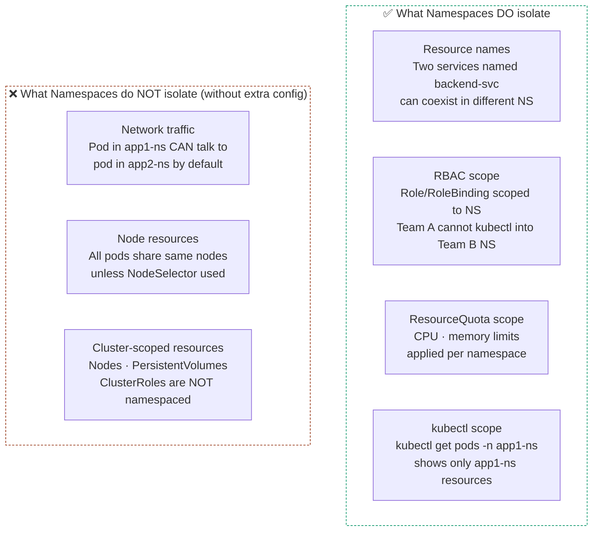
```mermaid
flowchart TB
    subgraph DOES["✅ What Namespaces DO isolate"]
        D1["Resource names\nTwo services named backend-svc\ncan coexist in different NS"]
        D2["RBAC scope\nRole/RoleBinding scoped to NS\nTeam A cannot kubectl into Team B NS"]
        D3["ResourceQuota scope\nCPU · memory limits\napplied per namespace"]
        D4["kubectl scope\nkubectl get pods -n app1-ns\nshows only app1-ns resources"]
    end

    subgraph DOESNT["❌ What Namespaces do NOT isolate (without extra config)"]
        N1["Network traffic\nPod in app1-ns CAN talk to\npod in app2-ns by default"]
        N2["Node resources\nAll pods share same nodes\nunless NodeSelector used"]
        N3["Cluster-scoped resources\nNodes · PersistentVolumes\nClusterRoles are NOT namespaced"]
    end

    style DOES fill:transparent,stroke:#1D9E75,stroke-dasharray:3 2
    style DOESNT fill:transparent,stroke:#993C1D,stroke-dasharray:3 2
```

### Same Resource Name — No Conflict Across Namespaces

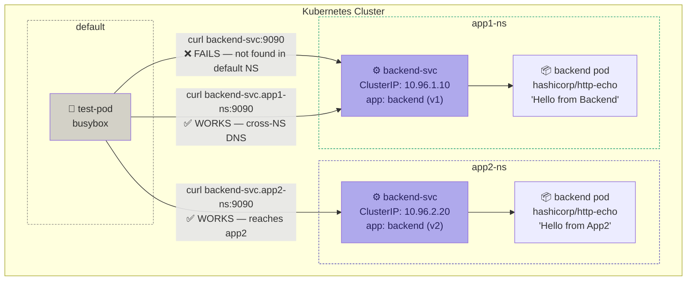
```mermaid
flowchart TB
    subgraph CLUSTER["Kubernetes Cluster"]
        subgraph APP1["app1-ns"]
            A_SVC["⚙️ backend-svc\nClusterIP: 10.96.1.10\napp: backend (v1)"]
            A_POD["📦 backend pod\nhashicorp/http-echo\n'Hello from Backend'"]
        end
        subgraph APP2["app2-ns"]
            B_SVC["⚙️ backend-svc\nClusterIP: 10.96.2.20\napp: backend (v2)"]
            B_POD["📦 backend pod\nhashicorp/http-echo\n'Hello from App2'"]
        end
        subgraph DEFAULT["default"]
            T["🧪 test-pod\nbusybox"]
        end
    end

    A_SVC --> A_POD
    B_SVC --> B_POD

    T -->|"curl backend-svc:9090\n❌ FAILS — not found in default NS"| A_SVC
    T -->|"curl backend-svc.app1-ns:9090\n✅ WORKS — cross-NS DNS"| A_SVC
    T -->|"curl backend-svc.app2-ns:9090\n✅ WORKS — reaches app2"| B_SVC

    style APP1 fill:transparent,stroke:#1D9E75,stroke-dasharray:3 2
    style APP2 fill:transparent,stroke:#534AB7,stroke-dasharray:3 2
    style DEFAULT fill:transparent,stroke:#888780,stroke-dasharray:3 2
    style A_SVC fill:#AFA9EC,color:#26215C
    style B_SVC fill:#AFA9EC,color:#26215C
    style T fill:#D3D1C7,color:#2C2C2A
```

### Resource Isolation Model with Quotas

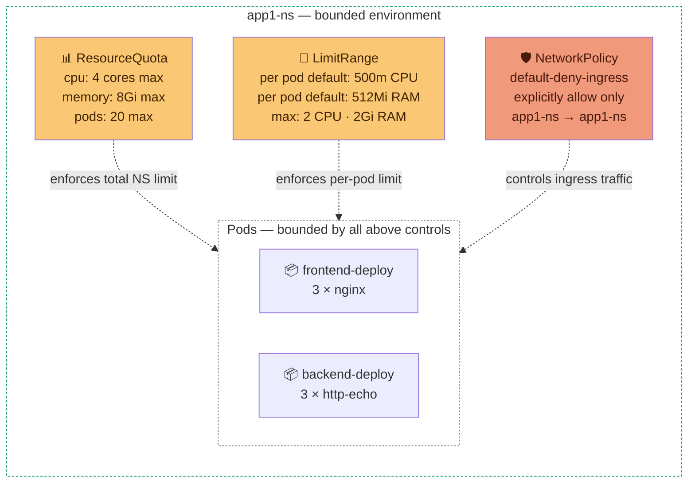
```mermaid
flowchart LR
    subgraph NS["app1-ns — bounded environment"]
        direction TB
        RQ["📊 ResourceQuota\ncpu: 4 cores max\nmemory: 8Gi max\npods: 20 max"]
        LR_BOX["📏 LimitRange\nper pod default: 500m CPU\nper pod default: 512Mi RAM\nmax: 2 CPU · 2Gi RAM"]
        NP["🛡️ NetworkPolicy\ndefault-deny-ingress\nexplicitly allow only\napp1-ns → app1-ns"]

        subgraph PODS["Pods — bounded by all above controls"]
            P1["📦 frontend-deploy\n3 × nginx"]
            P2["📦 backend-deploy\n3 × http-echo"]
        end

        RQ -.->|"enforces total NS limit"| PODS
        LR_BOX -.->|"enforces per-pod limit"| PODS
        NP -.->|"controls ingress traffic"| PODS
    end

    style NS fill:transparent,stroke:#1D9E75,stroke-dasharray:3 2
    style PODS fill:transparent,stroke:#888780,stroke-dasharray:2 2
    style RQ fill:#FAC775,color:#412402
    style LR_BOX fill:#FAC775,color:#412402
    style NP fill:#F0997B,color:#4A1B0C
```

---

## 4. Cross-Namespace Communication — DNS Deep Dive

### How CoreDNS Resolves Across Namespaces

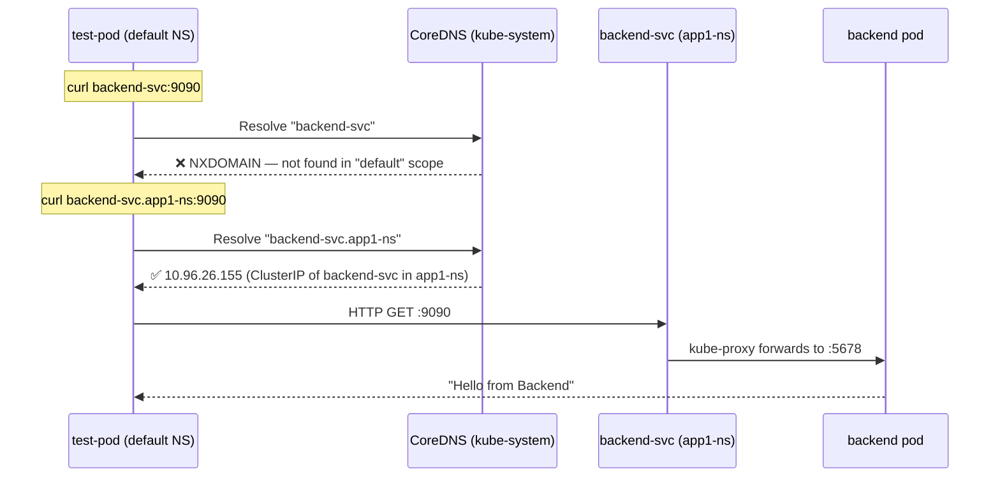
```mermaid
sequenceDiagram
    participant TP as test-pod (default NS)
    participant DNS as CoreDNS (kube-system)
    participant SVC as backend-svc (app1-ns)
    participant POD as backend pod

    Note over TP: curl backend-svc:9090
    TP->>DNS: Resolve "backend-svc"
    DNS-->>TP: ❌ NXDOMAIN — not found in "default" scope

    Note over TP: curl backend-svc.app1-ns:9090
    TP->>DNS: Resolve "backend-svc.app1-ns"
    DNS-->>TP: ✅ 10.96.26.155 (ClusterIP of backend-svc in app1-ns)
    TP->>SVC: HTTP GET :9090
    SVC->>POD: kube-proxy forwards to :5678
    POD-->>TP: "Hello from Backend"
```

### DNS Format — All Three Forms

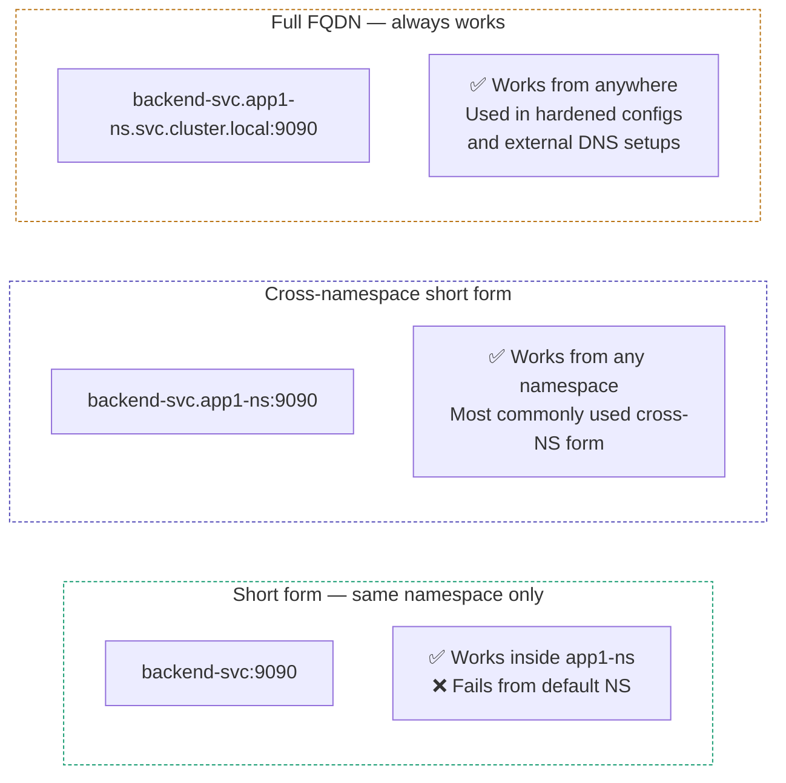
```mermaid
flowchart LR
    subgraph FORM1["Short form — same namespace only"]
        F1A["backend-svc:9090"]
        F1B["✅ Works inside app1-ns\n❌ Fails from default NS"]
    end
    subgraph FORM2["Cross-namespace short form"]
        F2A["backend-svc.app1-ns:9090"]
        F2B["✅ Works from any namespace\nMost commonly used cross-NS form"]
    end
    subgraph FORM3["Full FQDN — always works"]
        F3A["backend-svc.app1-ns.svc.cluster.local:9090"]
        F3B["✅ Works from anywhere\nUsed in hardened configs\nand external DNS setups"]
    end

    style FORM1 fill:transparent,stroke:#1D9E75,stroke-dasharray:3 2
    style FORM2 fill:transparent,stroke:#534AB7,stroke-dasharray:3 2
    style FORM3 fill:transparent,stroke:#BA7517,stroke-dasharray:3 2
```

### DNS Name Structure Breakdown

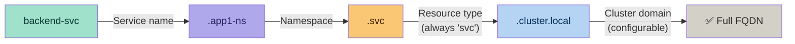
```mermaid
flowchart LR
    A["backend-svc"]
    B[".app1-ns"]
    C[".svc"]
    D[".cluster.local"]
    E["✅ Full FQDN"]

    A -->|"Service name"| B
    B -->|"Namespace"| C
    C -->|"Resource type\n(always 'svc')"| D
    D -->|"Cluster domain\n(configurable)"| E

    style A fill:#9FE1CB,color:#04342C
    style B fill:#AFA9EC,color:#26215C
    style C fill:#FAC775,color:#412402
    style D fill:#B5D4F4,color:#042C53
    style E fill:#D3D1C7,color:#2C2C2A
```

| Scope | Format | Example | Works from |
|---|---|---|---|
| Same namespace | `<svc>:<port>` | `backend-svc:9090` | Same NS only |
| Cross-namespace | `<svc>.<ns>:<port>` | `backend-svc.app1-ns:9090` | Any NS |
| Full FQDN | `<svc>.<ns>.svc.cluster.local` | `backend-svc.app1-ns.svc.cluster.local:9090` | Anywhere |

---

## 5. Working with Namespaces

### Creating a Namespace

#### Imperative (quick, dev/debug)
```bash
kubectl create namespace app1-ns

# Verify
kubectl get ns app1-ns
# NAME      STATUS   AGE
# app1-ns   Active   3s
```

#### Declarative (recommended — commit to git)

From your uploaded `app1-ns.yaml`:
```yaml
# app1-ns.yaml
apiVersion: v1
kind: Namespace
metadata:
  name: app1-ns
```

```bash
kubectl apply -f app1-ns.yaml

# Idempotent — safe to run multiple times
# "namespace/app1-ns created" or "namespace/app1-ns unchanged"
```

### Namespace Lifecycle Commands

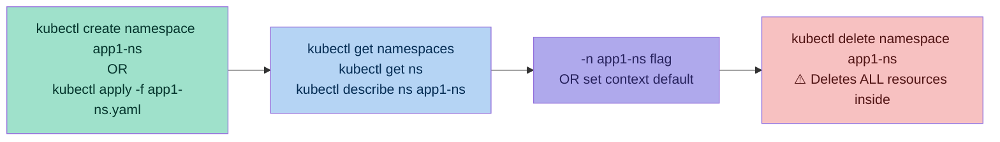
```mermaid
flowchart LR
    CREATE["kubectl create namespace app1-ns\nOR\nkubectl apply -f app1-ns.yaml"]
    VIEW["kubectl get namespaces\nkubectl get ns\nkubectl describe ns app1-ns"]
    USE["-n app1-ns flag\nOR set context default"]
    DELETE["kubectl delete namespace app1-ns\n⚠️ Deletes ALL resources inside"]

    CREATE --> VIEW --> USE --> DELETE

    style CREATE fill:#9FE1CB,color:#04342C
    style VIEW fill:#B5D4F4,color:#042C53
    style USE fill:#AFA9EC,color:#26215C
    style DELETE fill:#F7C1C1,color:#501313
```

```bash
# View all namespaces
kubectl get namespaces
kubectl get ns                          # short alias

# Describe — see labels, annotations, resource quotas
kubectl describe namespace app1-ns

# Delete — cascades to ALL resources inside!
kubectl delete namespace app1-ns
# ⚠️ This removes every pod, service, configmap, secret, deployment inside
# No confirmation prompt. Back up first.

# Recover — reapply your YAML files
kubectl apply -f app1-ns.yaml
kubectl apply -f backend-deploy.yaml -n app1-ns
kubectl apply -f frontend-deploy.yaml
```

### Namespace Flag Reference

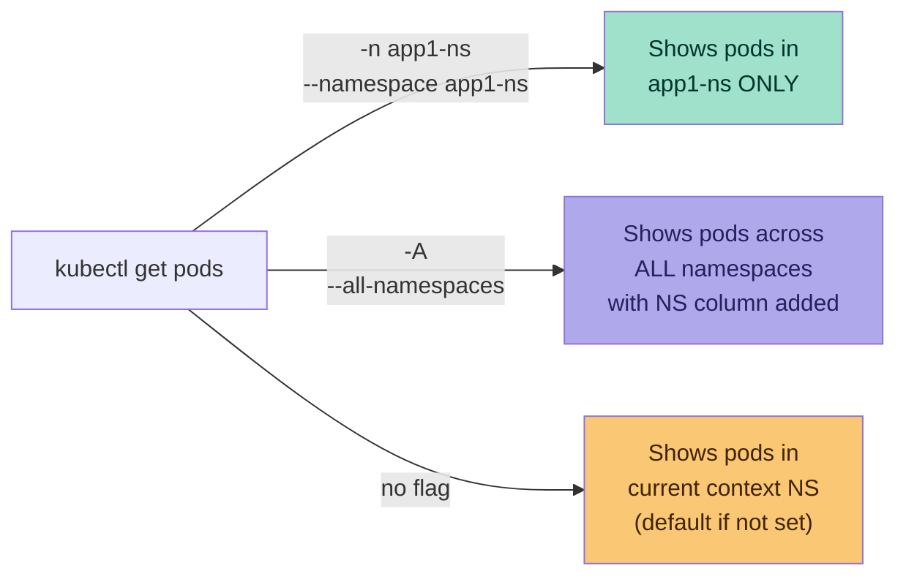
```mermaid
flowchart LR
    CMD["kubectl get pods"]

    CMD -->|"-n app1-ns\n--namespace app1-ns"| SPECIFIC["Shows pods in\napp1-ns ONLY"]
    CMD -->|"-A\n--all-namespaces"| ALL["Shows pods across\nALL namespaces\nwith NS column added"]
    CMD -->|"no flag"| CONTEXT["Shows pods in\ncurrent context NS\n(default if not set)"]

    style SPECIFIC fill:#9FE1CB,color:#04342C
    style ALL fill:#AFA9EC,color:#26215C
    style CONTEXT fill:#FAC775,color:#412402
```

```bash
# Specific namespace
kubectl get pods -n app1-ns
kubectl get all -n app1-ns

# All namespaces — great for cluster-wide view
kubectl get pods -A
kubectl get pods --all-namespaces

# Services across all namespaces
kubectl get svc -A

# Watch pods in real time across all namespaces
kubectl get pods -A -w
```

---

## 6. Deploying Frontend & Backend in app1-ns

### What's Different About These YAMLs

Your uploaded files show two different patterns — understand why:

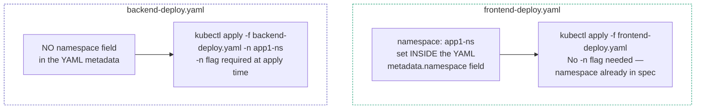
```mermaid
flowchart TB
    subgraph FE["frontend-deploy.yaml"]
        FE1["namespace: app1-ns\nset INSIDE the YAML\nmetadata.namespace field"]
        FE2["kubectl apply -f frontend-deploy.yaml\nNo -n flag needed —\nnamespace already in spec"]
    end

    subgraph BE["backend-deploy.yaml"]
        BE1["NO namespace field\nin the YAML metadata"]
        BE2["kubectl apply -f backend-deploy.yaml -n app1-ns\n-n flag required at apply time"]
    end

    FE1 --> FE2
    BE1 --> BE2

    style FE fill:transparent,stroke:#1D9E75,stroke-dasharray:3 2
    style BE fill:transparent,stroke:#534AB7,stroke-dasharray:3 2
```

> **Senior tip:** Embedding `namespace:` in the YAML is more explicit and safer for GitOps — the manifest always lands in the right namespace regardless of who runs it or what context they have set. However it makes manifests less reusable across environments. Teams pick their convention and stick to it.

### Namespace Deployment Architecture

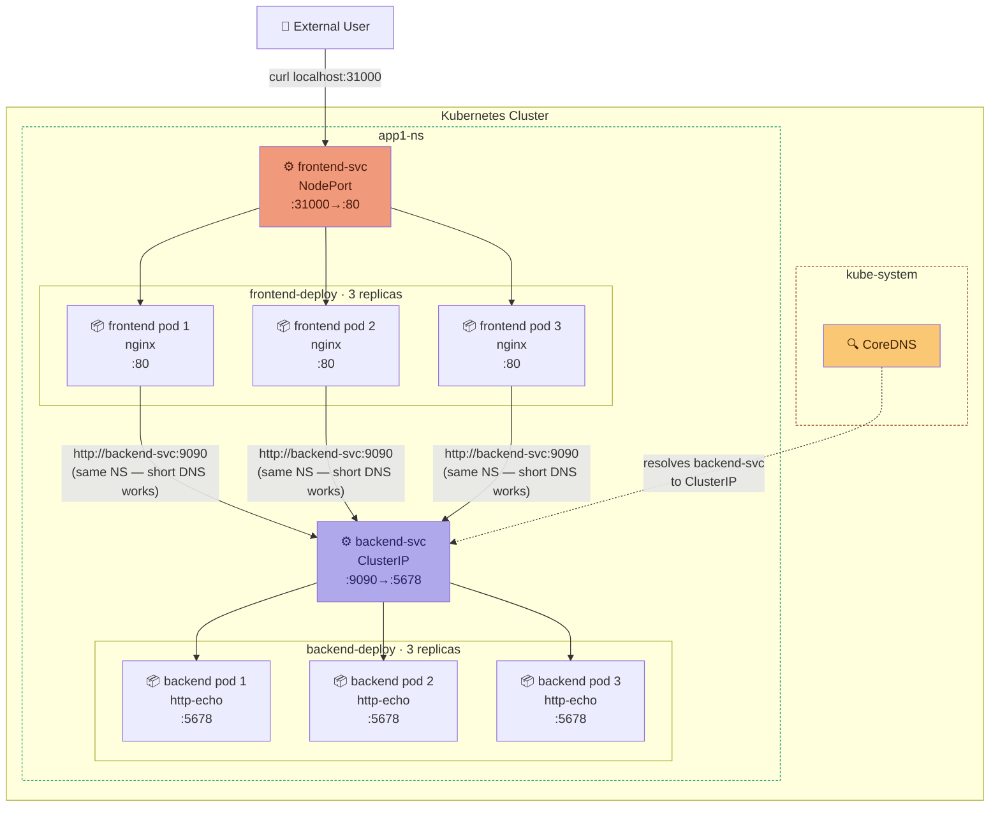
```mermaid
flowchart TD
    subgraph CLUSTER["Kubernetes Cluster"]
        subgraph APP1["app1-ns"]
            subgraph FE_DEP["frontend-deploy · 3 replicas"]
                FP1["📦 frontend pod 1\nnginx\n:80"]
                FP2["📦 frontend pod 2\nnginx\n:80"]
                FP3["📦 frontend pod 3\nnginx\n:80"]
            end
            subgraph BE_DEP["backend-deploy · 3 replicas"]
                BP1["📦 backend pod 1\nhttp-echo\n:5678"]
                BP2["📦 backend pod 2\nhttp-echo\n:5678"]
                BP3["📦 backend pod 3\nhttp-echo\n:5678"]
            end
            FSVC["⚙️ frontend-svc\nNodePort\n:31000→:80"]
            BSVC["⚙️ backend-svc\nClusterIP\n:9090→:5678"]
        end
        subgraph KS["kube-system"]
            DNS["🔍 CoreDNS"]
        end
    end

    USER["👤 External User"]
    USER -->|"curl localhost:31000"| FSVC
    FSVC --> FP1 & FP2 & FP3
    FP1 & FP2 & FP3 -->|"http://backend-svc:9090\n(same NS — short DNS works)"| BSVC
    BSVC --> BP1 & BP2 & BP3
    DNS -.->|"resolves backend-svc\nto ClusterIP"| BSVC

    style APP1 fill:transparent,stroke:#1D9E75,stroke-dasharray:3 2
    style KS fill:transparent,stroke:#993C1D,stroke-dasharray:3 2
    style FSVC fill:#F0997B,color:#4A1B0C
    style BSVC fill:#AFA9EC,color:#26215C
    style DNS fill:#FAC775,color:#412402
```

### YAML Files (from your uploads)

#### `app1-ns.yaml`
```yaml
apiVersion: v1
kind: Namespace
metadata:
  name: app1-ns
```

#### `backend-deploy.yaml` — no namespace in YAML (apply with -n flag)
```yaml
apiVersion: apps/v1
kind: Deployment
metadata:
  name: backend-deploy
  # ← no namespace field — must use -n app1-ns at apply time
spec:
  replicas: 3
  selector:
    matchLabels:
      app: backend
  template:
    metadata:
      labels:
        app: backend
    spec:
      containers:
        - name: backend-container
          image: hashicorp/http-echo
          args:
            - "-text=Hello from Backend"

---

apiVersion: v1
kind: Service
metadata:
  name: backend-svc
  # ← no namespace field — must use -n app1-ns at apply time
spec:
  type: ClusterIP
  ports:
    - protocol: TCP
      port: 9090        # service port (what callers dial)
      targetPort: 5678  # container port (what http-echo listens on)
  selector:
    app: backend
```

#### `frontend-deploy.yaml` — namespace embedded in YAML
```yaml
apiVersion: apps/v1
kind: Deployment
metadata:
  name: frontend-deploy
  namespace: app1-ns    # ← namespace baked into YAML
spec:
  replicas: 3
  selector:
    matchLabels:
      app: frontend
  template:
    metadata:
      labels:
        app: frontend
    spec:
      containers:
        - name: frontend-container
          image: nginx

---

apiVersion: v1
kind: Service
metadata:
  name: frontend-svc
  namespace: app1-ns    # ← namespace baked into YAML
spec:
  type: NodePort
  selector:
    app: frontend
  ports:
    - protocol: TCP
      port: 80          # ClusterIP layer port
      targetPort: 80    # container port (nginx)
      nodePort: 31000   # external port (30000-32767)
```

### Step-by-Step Deploy Commands

```bash
# Step 1 — create the namespace first
kubectl apply -f app1-ns.yaml
# namespace/app1-ns created

# Step 2 — deploy backend (no namespace in YAML — use -n flag)
kubectl apply -f backend-deploy.yaml -n app1-ns
# deployment.apps/backend-deploy created
# service/backend-svc created

# Step 3 — deploy frontend (namespace already in YAML — no -n needed)
kubectl apply -f frontend-deploy.yaml
# deployment.apps/frontend-deploy created
# service/frontend-svc created

# Step 4 — verify everything in app1-ns
kubectl get all -n app1-ns
# NAME                                   READY   STATUS    RESTARTS   AGE
# pod/backend-deploy-xxx-aaa             1/1     Running   0          30s
# pod/backend-deploy-xxx-bbb             1/1     Running   0          30s
# pod/backend-deploy-xxx-ccc             1/1     Running   0          30s
# pod/frontend-deploy-yyy-aaa            1/1     Running   0          30s
# pod/frontend-deploy-yyy-bbb            1/1     Running   0          30s
# pod/frontend-deploy-yyy-ccc            1/1     Running   0          30s
#
# NAME                   TYPE        CLUSTER-IP      EXTERNAL-IP   PORT(S)          AGE
# service/backend-svc    ClusterIP   10.96.26.155    <none>        9090/TCP         30s
# service/frontend-svc   NodePort    10.96.45.120    <none>        80:31000/TCP     30s

# Step 5 — verify endpoints (confirm labels match selectors)
kubectl get endpoints -n app1-ns
# NAME           ENDPOINTS
# backend-svc    10.244.1.5:5678,10.244.2.8:5678,10.244.3.3:5678
# frontend-svc   10.244.1.6:80,10.244.2.9:80,10.244.3.4:80
```

---

## 7. Full Architecture — How Everything Communicates

### Complete Request Flow with Namespace Boundaries

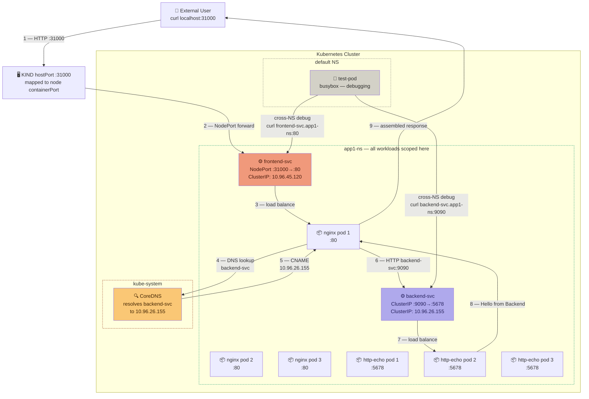
```mermaid
flowchart TD
    USER["👤 External User\ncurl localhost:31000"]
    KIND_HOST["🖥️ KIND hostPort :31000\nmapped to node containerPort"]

    subgraph CLUSTER["Kubernetes Cluster"]
        subgraph APP1["app1-ns — all workloads scoped here"]
            FSVC["⚙️ frontend-svc\nNodePort :31000→:80\nClusterIP: 10.96.45.120"]
            FP1["📦 nginx pod 1\n:80"]
            FP2["📦 nginx pod 2\n:80"]
            FP3["📦 nginx pod 3\n:80"]

            BSVC["⚙️ backend-svc\nClusterIP :9090→:5678\nClusterIP: 10.96.26.155"]
            BP1["📦 http-echo pod 1\n:5678"]
            BP2["📦 http-echo pod 2\n:5678"]
            BP3["📦 http-echo pod 3\n:5678"]
        end

        subgraph KS["kube-system"]
            DNS["🔍 CoreDNS\nresolves backend-svc\nto 10.96.26.155"]
        end

        subgraph DEF["default NS"]
            TP["🧪 test-pod\nbusybox — debugging"]
        end
    end

    USER -->|"1 — HTTP :31000"| KIND_HOST
    KIND_HOST -->|"2 — NodePort forward"| FSVC
    FSVC -->|"3 — load balance"| FP1
    FP1 -->|"4 — DNS lookup\nbackend-svc"| DNS
    DNS -->|"5 — CNAME\n10.96.26.155"| FP1
    FP1 -->|"6 — HTTP backend-svc:9090"| BSVC
    BSVC -->|"7 — load balance"| BP2
    BP2 -->|"8 — Hello from Backend"| FP1
    FP1 -->|"9 — assembled response"| USER

    TP -->|"cross-NS debug\ncurl backend-svc.app1-ns:9090"| BSVC
    TP -->|"cross-NS debug\ncurl frontend-svc.app1-ns:80"| FSVC

    style APP1 fill:transparent,stroke:#1D9E75,stroke-dasharray:3 2
    style KS fill:transparent,stroke:#993C1D,stroke-dasharray:3 2
    style DEF fill:transparent,stroke:#888780,stroke-dasharray:3 2
    style FSVC fill:#F0997B,color:#4A1B0C
    style BSVC fill:#AFA9EC,color:#26215C
    style DNS fill:#FAC775,color:#412402
    style TP fill:#D3D1C7,color:#2C2C2A
```

### Sequence Diagram — Full Request Lifecycle

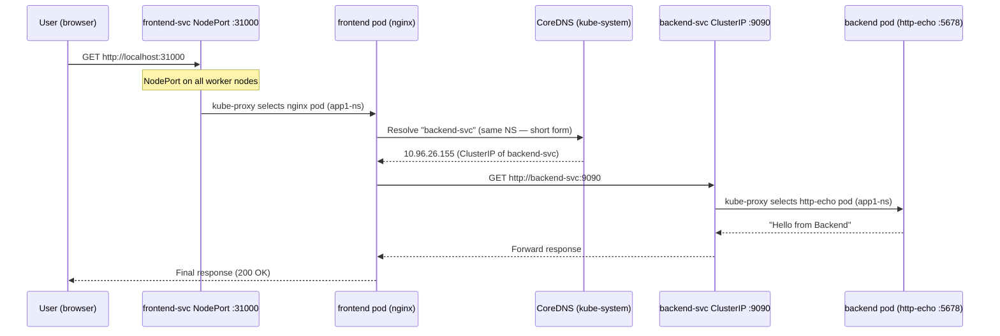
```mermaid
sequenceDiagram
    participant U as User (browser)
    participant NP as frontend-svc NodePort :31000
    participant FP as frontend pod (nginx)
    participant DNS as CoreDNS (kube-system)
    participant BS as backend-svc ClusterIP :9090
    participant BP as backend pod (http-echo :5678)

    U->>NP: GET http://localhost:31000
    Note over NP: NodePort on all worker nodes
    NP->>FP: kube-proxy selects nginx pod (app1-ns)
    FP->>DNS: Resolve "backend-svc" (same NS — short form)
    DNS-->>FP: 10.96.26.155 (ClusterIP of backend-svc)
    FP->>BS: GET http://backend-svc:9090
    BS->>BP: kube-proxy selects http-echo pod (app1-ns)
    BP-->>BS: "Hello from Backend"
    BS-->>FP: Forward response
    FP-->>U: Final response (200 OK)
```

---

## 8. Testing Namespace Isolation

### Isolation Test Matrix

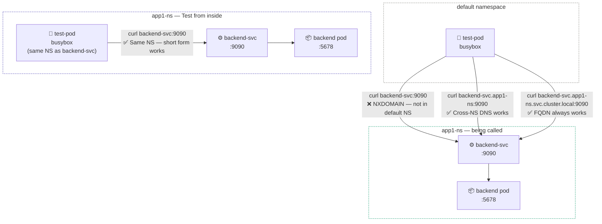
```mermaid
flowchart TB
    subgraph DEFAULT["default namespace"]
        TP_DEF["🧪 test-pod\nbusybox"]
    end

    subgraph APP1_A["app1-ns — Test from inside"]
        TP_APP1["🧪 test-pod\nbusybox\n(same NS as backend-svc)"]
        BSVC_A["⚙️ backend-svc\n:9090"]
        BP_A["📦 backend pod\n:5678"]
    end

    subgraph APP1_B["app1-ns — being called"]
        BSVC_B["⚙️ backend-svc\n:9090"]
        BP_B["📦 backend pod\n:5678"]
    end

    TP_DEF -->|"curl backend-svc:9090\n❌ NXDOMAIN — not in default NS"| BSVC_B
    TP_DEF -->|"curl backend-svc.app1-ns:9090\n✅ Cross-NS DNS works"| BSVC_B
    TP_DEF -->|"curl backend-svc.app1-ns.svc.cluster.local:9090\n✅ FQDN always works"| BSVC_B
    BSVC_B --> BP_B

    TP_APP1 -->|"curl backend-svc:9090\n✅ Same NS — short form works"| BSVC_A
    BSVC_A --> BP_A

    style DEFAULT fill:transparent,stroke:#888780,stroke-dasharray:3 2
    style APP1_A fill:transparent,stroke:#534AB7,stroke-dasharray:3 2
    style APP1_B fill:transparent,stroke:#1D9E75,stroke-dasharray:3 2
```

### Test 1 — From `default` namespace (cross-namespace)

```bash
# Launch busybox test pod in default namespace
kubectl run test-pod \
  --image=busybox \
  --rm -it \
  --restart=Never \
  -- /bin/sh

# Inside the pod — test each DNS form:

# ❌ Short form — fails from default namespace
wget -qO- http://backend-svc:9090
# wget: bad address 'backend-svc'

# ✅ Cross-namespace short form — works
wget -qO- http://backend-svc.app1-ns:9090
# Hello from Backend

# ✅ Full FQDN — always works
wget -qO- http://backend-svc.app1-ns.svc.cluster.local:9090
# Hello from Backend

# ✅ Access frontend from default NS too
wget -qO- http://frontend-svc.app1-ns:80
# <!DOCTYPE html> ... nginx welcome page

exit  # pod auto-deleted due to --rm
```

### Test 2 — From `app1-ns` (same namespace)

```bash
# Launch busybox inside app1-ns
kubectl run test-pod \
  -n app1-ns \
  --image=busybox \
  --rm -it \
  --restart=Never \
  -- /bin/sh

# Inside the pod:

# ✅ Short form — works (same namespace)
wget -qO- http://backend-svc:9090
# Hello from Backend

# ✅ Also works with namespace
wget -qO- http://backend-svc.app1-ns:9090
# Hello from Backend

# ✅ DNS resolution check
nslookup backend-svc
# Server:    10.96.0.10         ← CoreDNS ClusterIP
# Address:   10.96.0.10:53
# Name:      backend-svc.app1-ns.svc.cluster.local
# Address:   10.96.26.155       ← backend-svc ClusterIP

exit
```

### Isolation Test Results Summary

| Pod location | DNS form used | Command | Result |
|---|---|---|---|
| `default` NS | Short | `wget backend-svc:9090` | ❌ NXDOMAIN |
| `default` NS | Cross-NS | `wget backend-svc.app1-ns:9090` | ✅ Works |
| `default` NS | Full FQDN | `wget backend-svc.app1-ns.svc.cluster.local:9090` | ✅ Works |
| `app1-ns` | Short | `wget backend-svc:9090` | ✅ Works |
| `app1-ns` | Cross-NS | `wget backend-svc.app1-ns:9090` | ✅ Works |
| `app1-ns` | Full FQDN | `wget backend-svc.app1-ns.svc.cluster.local:9090` | ✅ Works |

---

## 9. Setting a Default Namespace

### The Pain Without a Default

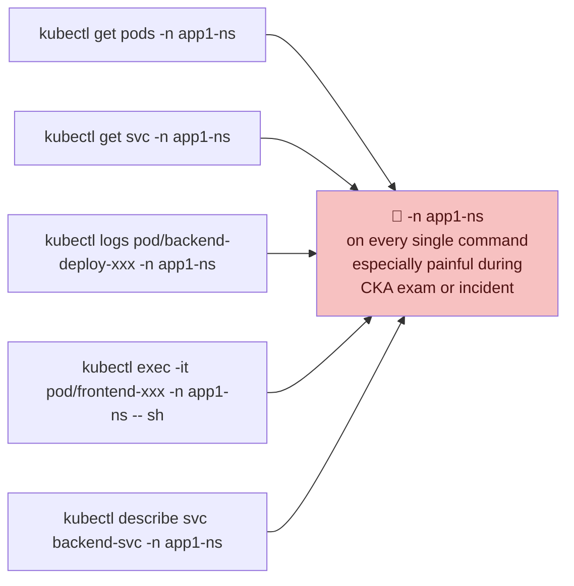
```mermaid
flowchart LR
    A["kubectl get pods -n app1-ns"]
    B["kubectl get svc -n app1-ns"]
    C["kubectl logs pod/backend-deploy-xxx -n app1-ns"]
    D["kubectl exec -it pod/frontend-xxx -n app1-ns -- sh"]
    E["kubectl describe svc backend-svc -n app1-ns"]

    A & B & C & D & E --> PAIN["😤 -n app1-ns\non every single command\nespecially painful during\nCKA exam or incident"]

    style PAIN fill:#F7C1C1,color:#501313
```

### The Fix

```bash
# Set app1-ns as the default for your current kubeconfig context
kubectl config set-context --current --namespace=app1-ns

# Verify context updated
kubectl config get-contexts
# CURRENT   NAME                     CLUSTER   AUTHINFO   NAMESPACE
# *         kind-my-second-cluster   kind      kind       app1-ns   ← updated

# Now all commands default to app1-ns — no -n flag needed
kubectl get pods          # ← shows app1-ns pods
kubectl get svc           # ← shows app1-ns services
kubectl get all           # ← shows all app1-ns resources
kubectl logs backend-deploy-xxx   # ← no -n needed
```

### How It Works Behind the Scenes

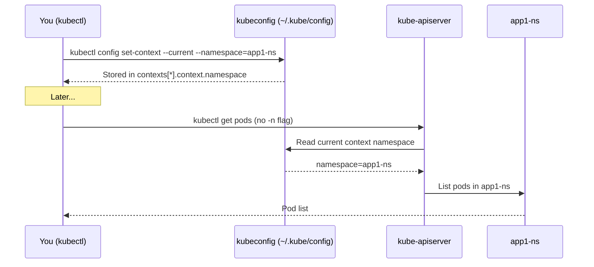
```mermaid
sequenceDiagram
    participant U as You (kubectl)
    participant KC as kubeconfig (~/.kube/config)
    participant API as kube-apiserver
    participant NS as app1-ns

    U->>KC: kubectl config set-context --current --namespace=app1-ns
    KC-->>U: Stored in contexts[*].context.namespace

    Note over U: Later...
    U->>API: kubectl get pods (no -n flag)
    API->>KC: Read current context namespace
    KC-->>API: namespace=app1-ns
    API->>NS: List pods in app1-ns
    NS-->>U: Pod list
```

```bash
# Check what namespace is currently set
kubectl config view --minify | grep namespace
#     namespace: app1-ns

# Reset back to default namespace when done
kubectl config set-context --current --namespace=default

# CKA exam tip — switch contexts AND namespace in one command
kubectl config use-context kind-my-second-cluster
kubectl config set-context --current --namespace=app1-ns
```

---

## 10. Real-World Troubleshooting Workflows

### Workflow 1 — Pod Can't Reach Service Across Namespaces

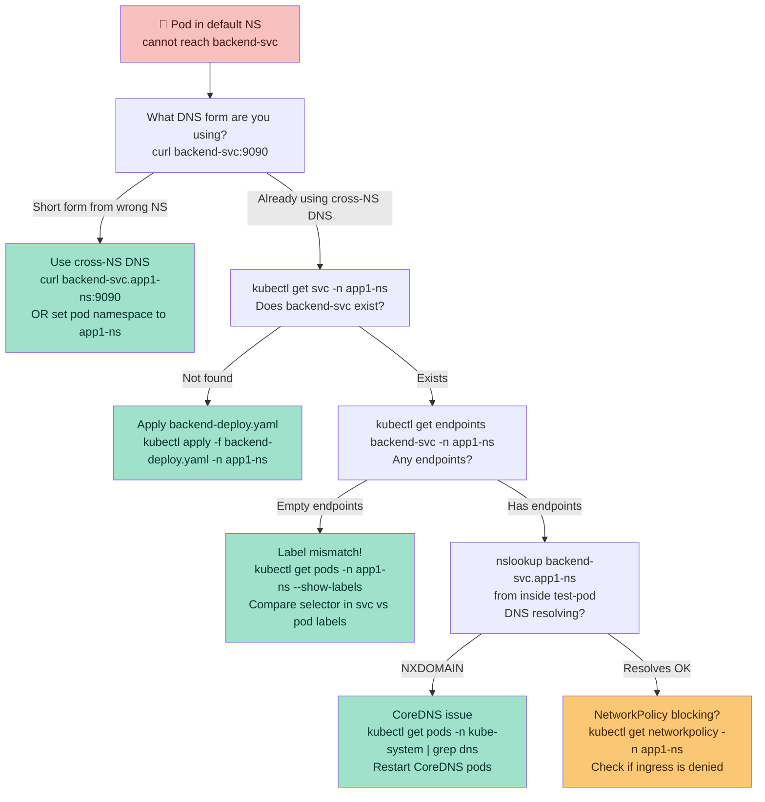
```mermaid
flowchart TD
    START["🚨 Pod in default NS\ncannot reach backend-svc"]

    START --> C1["What DNS form are you using?\ncurl backend-svc:9090"]
    C1 -->|"Short form from wrong NS"| F1["Use cross-NS DNS\ncurl backend-svc.app1-ns:9090\nOR set pod namespace to app1-ns"]

    C1 -->|"Already using cross-NS DNS"| C2["kubectl get svc -n app1-ns\nDoes backend-svc exist?"]
    C2 -->|"Not found"| F2["Apply backend-deploy.yaml\nkubectl apply -f backend-deploy.yaml -n app1-ns"]
    C2 -->|"Exists"| C3["kubectl get endpoints backend-svc -n app1-ns\nAny endpoints?"]

    C3 -->|"Empty endpoints"| F3["Label mismatch!\nkubectl get pods -n app1-ns --show-labels\nCompare selector in svc vs pod labels"]
    C3 -->|"Has endpoints"| C4["nslookup backend-svc.app1-ns\nfrom inside test-pod\nDNS resolving?"]
    C4 -->|"NXDOMAIN"| F4["CoreDNS issue\nkubectl get pods -n kube-system | grep dns\nRestart CoreDNS pods"]
    C4 -->|"Resolves OK"| F5["NetworkPolicy blocking?\nkubectl get networkpolicy -n app1-ns\nCheck if ingress is denied"]

    style START fill:#F7C1C1,color:#501313
    style F1 fill:#9FE1CB,color:#04342C
    style F2 fill:#9FE1CB,color:#04342C
    style F3 fill:#9FE1CB,color:#04342C
    style F4 fill:#9FE1CB,color:#04342C
    style F5 fill:#FAC775,color:#412402
```

### Workflow 2 — Namespace Accidentally Deleted

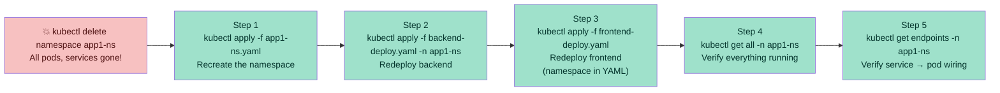
```mermaid
flowchart LR
    OOPS["💥 kubectl delete namespace app1-ns\nAll pods, services gone!"]

    OOPS --> R1["Step 1\nkubectl apply -f app1-ns.yaml\nRecreate the namespace"]
    R1 --> R2["Step 2\nkubectl apply -f backend-deploy.yaml -n app1-ns\nRedeploy backend"]
    R2 --> R3["Step 3\nkubectl apply -f frontend-deploy.yaml\nRedeploy frontend\n(namespace in YAML)"]
    R3 --> R4["Step 4\nkubectl get all -n app1-ns\nVerify everything running"]
    R4 --> R5["Step 5\nkubectl get endpoints -n app1-ns\nVerify service → pod wiring"]

    style OOPS fill:#F7C1C1,color:#501313
    style R1 fill:#9FE1CB,color:#04342C
    style R2 fill:#9FE1CB,color:#04342C
    style R3 fill:#9FE1CB,color:#04342C
    style R4 fill:#9FE1CB,color:#04342C
    style R5 fill:#9FE1CB,color:#04342C
```

### Senior Debug Cheat Sheet

```bash
# ── NAMESPACE STATUS ──────────────────────────────────────
kubectl get ns
kubectl describe ns app1-ns                  # see quotas, labels

# ── WHAT'S IN A NAMESPACE ─────────────────────────────────
kubectl get all -n app1-ns                   # pods, deployments, svc, rs
kubectl get pods -n app1-ns -o wide          # with node and IP columns
kubectl get pods -n app1-ns --show-labels    # check selector matching

# ── SERVICE WIRING ────────────────────────────────────────
kubectl get endpoints -n app1-ns             # empty = label mismatch
kubectl describe svc backend-svc -n app1-ns  # selector, endpoints, ports

# ── DNS DEBUGGING ─────────────────────────────────────────
kubectl run dns-test -n app1-ns \
  --image=busybox --rm -it --restart=Never -- /bin/sh
# Inside:
nslookup backend-svc                         # same NS lookup
nslookup backend-svc.app1-ns                 # cross-NS lookup
nslookup backend-svc.app1-ns.svc.cluster.local   # FQDN

# ── CROSS-NAMESPACE TEST ──────────────────────────────────
kubectl run cross-test \
  --image=busybox --rm -it --restart=Never -- /bin/sh
# Inside (from default NS):
wget -qO- http://backend-svc.app1-ns:9090    # should return backend response

# ── RESOURCE QUOTAS ───────────────────────────────────────
kubectl get resourcequota -n app1-ns
kubectl describe resourcequota -n app1-ns

# ── CONTEXT / NAMESPACE CONFIG ────────────────────────────
kubectl config get-contexts
kubectl config view --minify | grep namespace
kubectl config set-context --current --namespace=app1-ns
```

---

## 11. Best Practices — Production Grade

```mermaid
flowchart TB
    BP["Production Namespace\nBest Practices"]

    BP --> B1["🏷️ Naming convention\nformat: team-app-env\nfrontend-prod-ns\nbackend-staging-ns\npayments-dev-ns"]
    BP --> B2["📊 Always set ResourceQuota\ncpu · memory · pod count\nPrevent one team from\nstarving the whole cluster"]
    BP --> B3["🛡️ NetworkPolicy from day 1\nDefault-deny all ingress\nExplicitly whitelist\nonly needed flows"]
    BP --> B4["🔐 RBAC per namespace\nServiceAccount per app\nRole + RoleBinding per team\nNever use cluster-admin"]
    BP --> B5["🌿 Separate env namespaces\ndev-ns · staging-ns · prod-ns\nDifferent replicas and quotas\nper environment"]
    BP --> B6["📄 Namespace in YAML or -n flag\nPick a convention and stick\nGitOps: bake NS in YAML\nFlexible: use -n flag"]
    BP --> B7["⚠️ Deletion protection\nAdd ResourceQuota\nUse namespace labels\nfor admission webhooks\nthat block accidental deletes"]

    style BP fill:#AFA9EC,color:#26215C
    style B1 fill:#9FE1CB,color:#04342C
    style B2 fill:#9FE1CB,color:#04342C
    style B3 fill:#9FE1CB,color:#04342C
    style B4 fill:#9FE1CB,color:#04342C
    style B5 fill:#9FE1CB,color:#04342C
    style B6 fill:#9FE1CB,color:#04342C
    style B7 fill:#F7C1C1,color:#501313
```

### ResourceQuota — Production Example

```yaml
# resource-quota.yaml
apiVersion: v1
kind: ResourceQuota
metadata:
  name: app1-quota
  namespace: app1-ns
spec:
  hard:
    requests.cpu: "4"          # total CPU requests allowed
    requests.memory: 8Gi       # total memory requests allowed
    limits.cpu: "8"            # total CPU limits allowed
    limits.memory: 16Gi        # total memory limits allowed
    pods: "20"                 # max pods in this namespace
    services: "10"             # max services
    persistentvolumeclaims: "5" # max PVCs
```

```bash
kubectl apply -f resource-quota.yaml

# Check quota usage
kubectl describe resourcequota app1-quota -n app1-ns
# Name:                   app1-quota
# Namespace:              app1-ns
# Resource                Used    Hard
# --------                ---     ---
# limits.cpu              1500m   8
# limits.memory           3Gi     16Gi
# pods                    6       20
# requests.cpu            750m    4
# requests.memory         1536Mi  8Gi
```

---

## 12. Summary

### Complete Namespace Communication Map

```mermaid
flowchart TB
    subgraph CLUSTER["Kubernetes Cluster"]
        subgraph KS["kube-system"]
            DNS["🔍 CoreDNS\nresolves all service DNS\nfor every namespace"]
        end

        subgraph APP1["app1-ns — your uploaded YAMLs"]
            A_FSVC["⚙️ frontend-svc\nNodePort :31000"]
            A_FE["📦 frontend pods\nnginx × 3"]
            A_BSVC["⚙️ backend-svc\nClusterIP :9090"]
            A_BE["📦 backend pods\nhttp-echo × 3"]
        end

        subgraph APP2["app2-ns — another team"]
            B_BSVC["⚙️ backend-svc\nClusterIP :9090\n(same name — no conflict)"]
            B_BE["📦 backend pods"]
        end

        subgraph DEF["default NS"]
            TP["🧪 test-pod\nfor debugging"]
        end
    end

    EXT["👤 External User"]

    EXT -->|"curl localhost:31000"| A_FSVC
    A_FSVC --> A_FE
    A_FE -->|"backend-svc:9090\n(same NS)"| A_BSVC --> A_BE

    TP -->|"backend-svc:9090 ❌"| A_BSVC
    TP -->|"backend-svc.app1-ns:9090 ✅"| A_BSVC
    TP -->|"backend-svc.app2-ns:9090 ✅"| B_BSVC --> B_BE

    DNS -.->|"resolves"| A_BSVC
    DNS -.->|"resolves"| B_BSVC

    style CLUSTER fill:transparent,stroke:#888780,stroke-dasharray:5 4
    style KS fill:transparent,stroke:#993C1D,stroke-dasharray:3 2
    style APP1 fill:transparent,stroke:#1D9E75,stroke-dasharray:3 2
    style APP2 fill:transparent,stroke:#534AB7,stroke-dasharray:3 2
    style DEF fill:transparent,stroke:#888780,stroke-dasharray:3 2
    style A_FSVC fill:#F0997B,color:#4A1B0C
    style A_BSVC fill:#AFA9EC,color:#26215C
    style B_BSVC fill:#AFA9EC,color:#26215C
    style DNS fill:#FAC775,color:#412402
```

### Key Takeaways Table

| Concept | Key Point |
|---|---|
| Namespace = naming scope | Isolates names + RBAC — NOT network traffic by default |
| Same NS DNS | `service-name:port` — short form, works only within same NS |
| Cross-NS DNS | `service.namespace:port` — works from any NS |
| Full FQDN | `service.namespace.svc.cluster.local` — always works everywhere |
| `namespace:` in YAML | Safer for GitOps — manifest always lands in right NS |
| `-n flag` | Flexible — same manifest deployable to any NS |
| `kubectl delete namespace` | Cascading delete — removes ALL resources. No confirmation |
| Empty `kubectl get endpoints` | Label mismatch between service selector and pod labels |
| Set context default NS | `kubectl config set-context --current --namespace=X` — saves typing |
| ResourceQuota | Governance per namespace — prevents one team starving others |

---

## References
- [Kubernetes Namespaces Documentation](https://kubernetes.io/docs/concepts/overview/working-with-objects/namespaces/)
- [ResourceQuota Documentation](https://kubernetes.io/docs/concepts/policy/resource-quotas/)
- [NetworkPolicy Documentation](https://kubernetes.io/docs/concepts/services-networking/network-policies/)
- [kubectl Cheat Sheet](https://kubernetes.io/docs/reference/kubectl/cheatsheet/)
